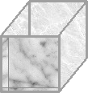

\[caption id="attachment\_19" align="alignnone" width="109" caption="storage"\]\[/caption\]

So got two calls this week about a storage specialist job.

I suspect both are for the same job but for both top of the list was EMC - Symmetrix and CLARiiON knowledge.

So!

Today I will be googling around for some information that describes them.

Just read a little about the tiering and that looks really awesome. Having data that is frequently accessed on SSD drives and when they move down in use they can be moved down to another tier with cheaper/larger disks. Just brilliant.

\*\*\*

So updating inside the post.

Found this aricle: http://storagenerve.com/2008/12/19/emc-symmetrix-management-console/ looks pretty nice. Would like to find a user guide that shows how to install and how to use it :)

\*\*\*

Maybe those aren't supposed to be public. Hard to find them on EMC's website anyway ;/

\*\*\*

Going to a flea market today, need some chairs for the upcoming move-in party :)

\*\*\*

http://finland.emc.com/collateral/demos/microsites/mediaplayer-video/application-view-provisioning-storage-vmax.htm

.. which stops after 5 seconds in FF4b9 and IE8 :/ same goes for videos. sucky website.

\*\*\*

Crappy image yeah I know but I'll try to get better ;)
