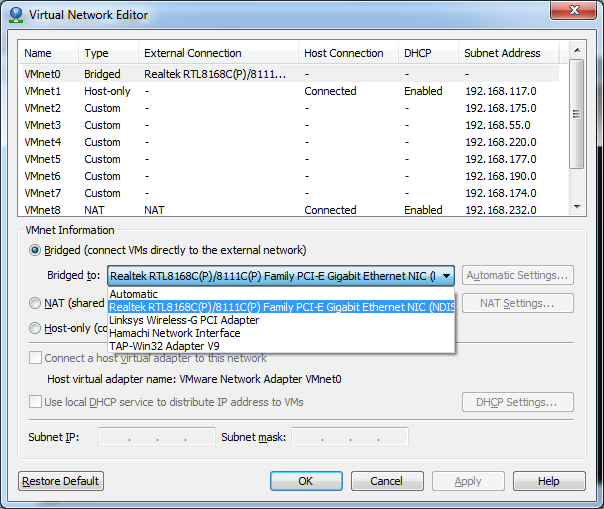

So, you have this awesome Virtual Machine running in your local area network (LAN) and want to be able to forward a port from your broadband router so it can be accessed by somebody else?

Doesn't work?

In VMWare Workstation go to Edit -> Virtual Network Editor. Then use one of the unused VMNets or just use the top one that is bridged. In the menu below you will see several interfaces -> if you see more than one, that could for example be if you have both a cable and wireless Ethernet connection, Hamachi also pops up in there.

Like this:

\[caption id="attachment\_196" align="alignnone" width="604"\] VMWare Network Editor\[/caption\]

So go ahead and change that to the one that gives your host access to the LAN.

Also make sure that the IP settings on your VM are adequate, DHCP should work but if it doesn't - try with a static setup in the same subnet as your host is (DNS should be the broadband router).

On Windows the useful commands to troubleshoot this would be: route print, ipconfig /all, ping. I usually ping this host: ping.sunet.se
