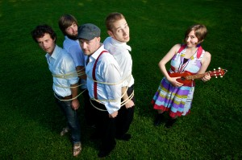

[Dying is Fine - Ra Ra Riot](http://rarariot.tumblr.com/post/5334715256/hey-uk-europe-we-are-psyched-to-announce-that "on tumblr") -
Sounds a lot like Morrissey occasionally, but not often enough for me to start
hurling, so I liek. Beware of their main web
site [http://www.rarariot.com/](http://www.rarariot.com/) - you can get
epilepsia for free there. Wild bass in the song **Boy** - check it out, nowz!

[Whoa oh oh oh](http://www.thesixtyone.com/#/s/lYmaLJnYDkF/album/ "on t61") -
The Ascetic Junkies - not only with a mandarin ;) - From Portland? Kind of make
sense, definitely a hippie vibe to it :) They call it 'whiskeystomp' for no good
reason! Is that a good reason?

**[The Whigs](http://www.thewhigs.com/news ".com") -** nice rocking motion,
especially in the beginning of "I am for real". Not so many tunes on t61 but
there is youtube as well ;)

[Great Intro - \\"I am for real - The Whigs\\"](http://www.youtube.com/watch?v=cbA3ZZAASQQ&feature=BFa&list=AVGxdCwVVULXcYmKVeLWnX6Q1I2OqJdOqr&index=2)
