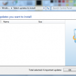

Ever noticed this?

I googled my behind off and saw some posts about registry , re-registering, runing as administrator but any way the last
one did not work. A restart do get them back. Maybe not the most awesome 'fix' but I think a restart might be good every
now and then for Windows ;)
