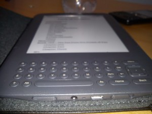

---
title: Buying Kindle in Finland
date: 2011-06-30
category: finland, it
tags: amazon, kindle, books, e-book, ebook-reader, e-reader, ebook, eject, ereader, fantasy, kindle, linux, reading, shopping, steven, erikson

On the 28th I purchased it around 1900. Today on the 30th at 0820 it arrived in the airport in Helsinki. Also yesterday somebody called and said it would come this week.

\*\*\* Update: It's now on the way to my work! Got it around 12 or so. Less than 48 hours to get the Kindle (and it came from Reno, NV, US!).

 

### Purchase

I got it from the American amazon.com - where it cost 140$ - totally it came to 240$ (got a black cover without light, shipping and VAT charge as well). Cheapest? Maybe not, but the dollar is pretty weak at the moment.

The amazon.co.uk price is 111£.

Currency converted: 140 USD is worth 96.6 EUR. (1 USD : 0.69 EUR) Currency converted: 111 GBP is worth 123.21 EUR. (1 GBP : 1.11 EUR)

So I'm pretty confident that those 30€ is worth it, it still wouldn't be free shipping it from the UK page. But it's on the way!

### Thoughts

Have been looking forward to this a while now, but after I tried reading a little on a friend's Kindle (larger screen) I just had to go for it. I went with the smaller screen because I don't want to carry something in magazine size. Pocket size now that's more like it.

But I wonder if I will miss reading large ass 1000 pages books like '[Dust of Dreams](http://www.guldmyr.com/blog/fantasy-book-review-steven-erikson-dust-of-dreams/ "on guldmyr.com")' or '[Game of Thrones](http://www.guldmyr.com/blog/fantasy-book-review-george-r-r-martin-a-game-of-thrones/ "on guldmyr.com")'? What I won't miss is carrying that book around though maybe it does make my arms a little stronger? =) First book I'm going to try is '[The Crippled God](http://en.wikipedia.org/wiki/The_Crippled_God_(novel) "on wikipedia")' by Steven Erikson.

### Unwrapping & First sight

It comes in nice no-tape boxes (well the larger package does but not the smaller ones inside). Environmentally friendly - I like.  I never held one of this size in my hand before - but it feels pretty good. Not heavy at all (in comparison to my normal books), not too light either.

It's a little uncomfortable to write things on it (tried to set up wireless access). So I'll have to do that when I come home and are sure of the passwords/logins :) Set the wireless up when I was at home, worked great. No problem at all. I think the writing on it just takes a little bit to get used to. It's not buttons like on a keyboard, it's more like round thin buttons.

\[caption id="attachment\_890" align="alignnone" width="300" caption="kindle bottom"\]\[/caption\]

### Eject on Linux

If you run linux on your PC - you cannot start using it from scratch. It will tell you that you need to eject the Kindle before - and it's not charging. The command you type is:

eject /dev/sdb1

/dev/sdb1  can vary. I just hit 'dmesg' and saw that there was a 3GiB device connected on \[sdb\]. Be careful not to eject your other disks :) You may have to have root access to do this, if so, try: sudo eject /dev/sdb1

In the end of 'dmesg' you should see this after you connect the kindle:

scsi 5:0:0:0: Direct-Access **Kindle** Internal Storage 0100 PQ: 0 ANSI: 2 sd 5:0:0:0: Attached scsi generic sg2 type 0 sd 5:0:0:0: \[**sdb**\] Attached SCSI removable disk sd 5:0:0:0: \[**sdb**\] 6410688 512-byte logical blocks: (3.28 GB/3.05 GiB) sd 5:0:0:0: \[**sdb**\] Assuming drive cache: write through sd 5:0:0:0: \[**sdb**\] Assuming drive cache: write through

This was on my RHEL 6 - Red Hat workstation. The syntax is the same for [Ubuntu](http://iamyouruser.blogspot.com/2009/03/ubuntu-eject-kindle.html "on ubuntu") so it sounds more like a Linux thing than a distribution specific thing. Of course you might also be able to do it graphically - depending on your window manager.

### Reading

Also did some reading with it in the sofa and in the bed and it's just perfect. Thinking that maybe when I'm at home I don't need the cover - which would make it less heavy - which is good when lying down.
