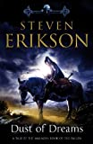

Grabbed this book a week or two ago and have been steadily pulling myself through it. Not done yet, some 300 pages left. I have crappy memory so if I write down what's going on right now, maybe that will help me remember the book later :)

It is the 9th book in the series (there are other novellas before, in between these if you look at things [chronologically](http://en.wikipedia.org/wiki/Malazan_Book_of_the_Fallen#Chronology "on wikipedia")) and it's happening at the same time as Toll the Hounds and it's in a 'pair' with The Crippled God - the fabled last book of the series.

**Beware - this post contains spoilers. If you haven't read the previous works in this series you probably shouldn't keep on reading.**

I like that whenever people see me reading an Erikson book they always say wow it's so big and then their jaws drop when I say it's the 9th in the series :p Some of the books do feel longer than others, it all depends what is happening, perhaps if there are long stretches in the book about characters that I don't like or feel a 'connection' to, the book will feel longer.

_Moving on - closer to topic:_

The Akrynnai vs. Barghast war in this book I don't feel much for and I'm kind of relieved now when it appears to be coming to a conclusion (some 300 pages left). Maybe that's because I hope the Malazans will do **_something._** Or maybe this will start making more sense in the 2nd book.

There was a lot about the Bonehunters in the beginning of the book but pretty soon they set out on a march - and there's not much about the march - as there's been quite a lot about that in the previous books I can understand why there's less of it, not that I particularly like it. Things like scorpion matches/bets and the dark humor might be what I like best, majestic battles do get a bit boring/repetitive? Or maybe have I also turned into one of the veterans in the Bonehunters? Been there, done that, "just get on with it for feck sake".

The other groups I do actually enjoy - the Taxilian/Ghost investigation inside that huge mechanism - the snake of children walking in the desert (I actually read longer poems here, which I must admit I usually don't when they are in the beginning of each chapter, although if I paid more attention that would probably give me more clues as to what is happening). Do you read the poems? Do you ever read poems? Any ideas / tips for how to get my interest up a bit? Please comment or drop me an e-mail :)
