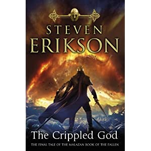

---
title: Fantasy Book Review - Steven Erikson - The Crippled God - Part 1
date: 2011-07-04
category: finland
tags: book, crippled, god, fantasy, malaz, malazan, reading, review, steven, eriksson

**Warning: this post contains spoilers if you haven't read Dust of Dreams or the previous books in the series Malazan Book of the Fallen.**

This post is part of a series, I will create additional one throughout the book (basically I'm just testing which is best: use one post and make updates or create new one every now and then? **What do you think?**)

End of [Dust of Dreams](http://www.guldmyr.com/blog/fantasy-book-review-steven-erikson-dust-of-dreams/ "my review of dust of dreams"): I didn’t particularly enjoy the [K’Chain Che’Malle](http://malazan.wikia.com/wiki/K%27Chain_Che%27Malle "on malazan.wikia") early in the book (read: before the last three-four chapters). But then I kind of started to like them. Why are they so uncomplicated? There’s a lot of unknowns at the end of this book - which is nice. Some folks haven’t even been clashing yet - Draconus/Ublala - Torrent/Mappo/Setoc - [Silchas Ruin](http://malazan.wikia.com/wiki/Silchas_Ruin "on malazan.wikia.com"). Which proves that the next(last) book is going to be very very exciting. What happened to the Bonehunters? How crazy was Yil’s shadow dance? Is Quick Ben really dead? Was this the meaning? Is Icarium the Azath? Or did he close the gate that the Sky Keeps came from?

When Sinn/Grub arrived at the end and with fire stopped some Sky Keeps, before that there was another poem heard about Held/Rutt and Badalle where she spoke with Icarium. They are connected somehow?

So much unknown going on here. Maybe it will all make sense in the last book? At least some of it I hope will be explained :)

## Crippled God

\[caption id="" align="alignleft" width="300" caption="The Crippled God"\]\[/caption\]

Read the end of Dust of Dreams on the Kindle - liked it a lot. Especially when sometimes there is a word I don’t understand I can just point to it and then get a definition. I will read this book completely on the Kindle - what better way to get a good feel for the e-book reader than to give a behemoth like this a go?

 

 

 

  There are a few tricky words in Erikson's books. Off the top of my head I am fond of this word but rarely get the use for it: susurration _**(low continuous whispering sound)**_ altruism _**(opposite of selfishness)**_

At this point I feel happy that I'm reaching the end of this series. Will there be more books related to this world by Erikson? The co-creator [Ian C Esslemont](http://www.malazanempire.com/site/authors "on malazanempire.com") should come out with three more books (six in total).
