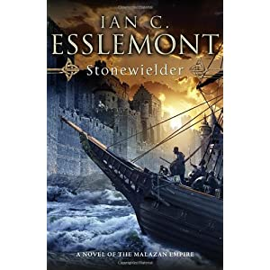

---
title: Book Review - Stonewielder by Ian C. Esslemont
date: 2011-09-28
category: finland
tags: book, fantasy, ian c esslemont, ice, malaz, malazan, review, steven, erikson, stonewielder

This is the third book in the Malazan world. The previous ones by Ian are Night of Knives and The Return of the Crimson Guard.

**Beware, this post will/may contain spoilers.**

I'm now roughly 41% through the book (reading it on my Kindle) and I must say that the writing style is fairly similar to the Stephen Erikson books. OK, there's a bit of change in how the chapters are ordered with the books.

The plots centers around the continent of Fist (also called Korel).Supposedly they would all come together in the end as there aren't any additional books planned after that would initially appear to be in the same series, but here's where we might be mistaken. As this book is not directly after The Return of the Crimson Guard (supposedly a few year after, but not directly, there are some gaps). Some of the important characters are common between the books.

[http://the-void.co.uk/book/interview-damn-contrarian-steven-erikson-conversation-094/](http://the-void.co.uk/book/interview-damn-contrarian-steven-erikson-conversation-094/) if you want to know what's happening after the Malazan Empire, apparently there's going to be books about the huge Toblakai Karsa Orlong!

Back to the Stonewielder. The Mael priest is now the Emperor and has managed to persuade some highly influential (and old) folks to join the cause to do something about the black stain on the Malazan empire: Korel. It appears that they've pretended to be Malaz but have in fact been running their own little empire. Not happy.

There's also the famous Stormwall, which has been mentioned quite often previously in the books but not too much has been written about the setups and what happens there. I believe Traveller hung out there for a while but he escaped. One side-plot surrounds a few Crimson Guard survivors that are prisoners/defenders on the wall, there are also a few of the Crimson Guard that have been crossing an [ice wasteland](http://1.bp.blogspot.com/_SniTwfm5BwE/TLXWdaAwCvI/AAAAAAAAC5A/U8wUnOMtmgs/s1600/Stonewieldermap.JPG "map") and later they all meet up for some nasty fighting. Good times.

Kyle with the "normal" name, (he was not a Malazan empire recruit) is quite funny. I mean a guy named Kyle kicking some ass just feels odd after dudes like Greymane, Paran, or Whiskeyjack.

I almost like this book more than the Steven Erikson books, but that I think is because they are different. There's not as much poetry in them for one, but maybe also because the Crimson Guard are bad ass!

After this one I decided to give Erikson's Crack Pot Trail a go, but this is one weird book. There is a narrator who is **very** present. At least in the beginning. This is one odd duck, but I suppose after so many books in normal 'Malazan' style this ought to be refreshing.

 

