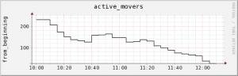

This is how to create simple RRD graphs using one data source that can be 0 and above. It is not an "ever increasing"
counter.

It will look like this:

[](images/movers.png)

## 1. Create the rrd database

I wrote this down in a .sh file so I can go back later and see how it was set up.

```bash
#!/bin/sh
rrdfile='/home/$user/rrd/movers.rrd'
rrdtool='/usr/bin/rrdtool'
$rrdtool create $rrdfile --step 300 DS:movers:GAUGE:600:U:U RRA:AVERAGE:0.5:1:576 RRA:AVERAGE:0.5:6:672 RRA:AVERAGE:0.5:24:732 RRA:AVERAGE:0.5:144:1460
```

- #5 minute step (base interval with which data will be fed into the RRD)
- #10 minute heartbeat for the data source #2 days of 5 minute averages
- #2 weeks of 1/2 hour averages
- #2 months of 2 hour averages
- #2 years of 12 hour averages

## 2 Add data to the rrd

Also done in a bash script. Because the --step above is set to 300, you need to run this script every 300 seconds (or
every 5 minutes). The script specified in $allpools prints the path to a file. Then with $output and $movers that file
is grepped for 'RUNNING' and then it counts how many lines that was - amount of movers.

```bash
#!/bin/sh
rrdfile='/home/$user/rrd/movers.rrd'
rrdtool='/usr/bin/rrdtool'

allpools='/home/$user/bash_script.sh'
output=$($allpools)
movers=$(grep RUNNING $output|wc -l)

$rrdtool update $rrdfile N:$movers
```

The N: is NOW. $movers is the value you want to plot.

## 3. Make a graph

Add this to another .sh script. This you can run at whatever interval you want.

```bash
#!/bin/sh
rrdfile='movers.rrd'
rrdtool='/usr/bin/rrdtool'
dpath="/var/www/html/graphs/movers"
alltimeimage="$dpath/movers.png"
lastweekimage="$dpath/moverslw.png"
lastmonthimage="$dpath/moverslm.png"
last4hoursimage="$dpath/moversl4h.png"
last3monthsimage="$dpath/moversl3m.png"
lastday="$dpath/moversld.png"
enddate=$(date +%s)
#enddate is the same as "now"
cd /home/$user/rrd

$rrdtool graph $alltimeimage --end now --start 1321603000 \
        -v from_beginning -t active_movers \
        DEF:movers=$rrdfile:movers:AVERAGE LINE:movers#000000
#rrdtool graph /path/to/image.png --end now --start when_I_started_capturing -v label_left -t title_top \
#DEF: as I only have one I only used movers, maybe you can change the names in case you have several data sources
#DEF: you can also use other things than AVERAGE (like MIN/MAX)
#LINE: #000000 is black

$rrdtool graph $lastweekimage --start -1w \
        -v last_week -t active_movers \
        DEF:movers=$rrdfile:movers:AVERAGE LINE:movers#000000 \
        AREA:movers#8C2E64 \
        GPRINT:movers:LAST:"Current: %1.0lf" \
        GPRINT:movers:MAX:"Max: %1.0lf" \
        GPRINT:movers:MIN:"Min: %1.0lf" \
        GPRINT:movers:AVERAGE:"Avg: %1.0lf"

#If you want to make it a little more complex. AREA fills the space between the value and the x-axis.
#GPRINT statements print some values relating to the graph.

$rrdtool graph $last4hoursimage --end now --start end-4h \
        -v last_4_hours -t active_movers \
        DEF:movers=$rrdfile:movers:AVERAGE LINE:movers#000000

$rrdtool graph $lastmonthimage --end now --start -1m \
        -v last_month -t active_movers \
        DEF:movers=$rrdfile:movers:AVERAGE LINE:movers#000000

$rrdtool graph $last3monthsimage --end now --start -8035200 \
        -v last_3_months -t active_movers \
        DEF:movers=$rrdfile:movers:AVERAGE LINE:movers#000000

$rrdtool graph $lastday --end now --start -1d \
        -v last_day -t active_movers \
        DEF:movers=$rrdfile:movers:AVERAGE LINE:movers#000000
```

## 4. Crontab - scheduling

```text
*/5 * * * * /bin/bash /home/$user/rrd/rrd.update.sh > /dev/null 2>&1 #every 5 minutes */15 * * * * /bin/bash /home/$user/rrd/rrd.graph.sh > /dev/null 2>&1 #every 15 minutes
```

## 5. Final Words

I am not providing the data gathering script here as you probably won't need it: it lists movers (transfers) on all
pools in a dCache system.
