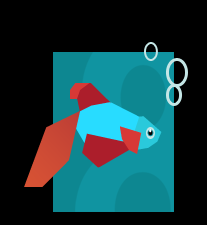

---
title: Windows 8 Consumer Preview in VMWare Workstation
date: 2012-02-29
category: it
tags: beta, preview, testing, vmware, vmware, workstation, windows, windows8, windows-8, preview

Checking out the new Windows 8 Consumer preview! Installing in a VM on a host with Windows 7 and Intel Core i7. Downloading the x64 English version from here: [http://windows.microsoft.com/en-US/windows-8/iso](http://windows.microsoft.com/en-US/windows-8/iso "http://windows.microsoft.com/en-US/windows-8/iso") _"To snap apps, you need a screen resolution of at least 1366 x 768"_ so I guess I better increase the resolution! Went with 1680x1050 which seems like an arbitrary number but with the highest (1920x1080) the text was blurry.

Could not detect which OS was on the disk, set it to Win7 x64. 4G RAM and 25G disk.

There's a funny fish shown during first install.

After this, enter language and hit install, enter license key, custom install, use all disk.

This appears to be the current loading screen while the computer is booting too :)

After windows boots you get to decide hostname, enter your windows account, make some settings if you want to update drivers, safety filters. You can enter some extra security stuff (e-mail, alternative e-mail, security question).

 

## Inside

To get to settings move the mouse cursor down to the bottom right corner.

A task bar is available if you move the cursor to the left top corner of the screen.

Xbox games doesn't work (not allowed to sign in from my region).

Pinball FX starts but it's lagging, a lot. But, if it's slow just hit the windows key and you're back to the block(s). In the end it doesn't work either.

There's a messaging square where you can add facebook, there's also an e-mail square where you can add gmail.

Weather shows temperature as Fahrenheit, even though all my settings in control panel are set to Sweden/Swedish.

So I put some music on the skydrive, and then started it (whereupon it downloads the song). It then starts up a media player that takes up the whole screen. You can tell that this is meant to be used for a tablet where you don't want clutter or where you want it to look nice.

Also, you go to settings to turn it off.
