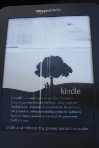

During the weekend the screen on my amazon kindle 6" decided to go partially
broken.It
happened while it was in my backpack inside a 'leather cover' that I also got
from amazon at the time of purchase.

Usually with these electronic devices it's that if the screen breaks you're on
your own / can try to get some help from home insurance. So my hopes were not so
high when I sent an e-mail to amazon.

They however just asked me to start a chat or call them. I started a chat
because I didn't feel like calling a US number (although they had apparently
some service that they'd call me back too), and got a very quick and efficient
response. They just asked me to reboot the device (hold the release thing for 30
seconds). They're sending a new one and will let me send back the broken one in
the same package and with a pre-paid shipment too!

Hope to get it soon, I feel nekkid without this e-book (or anything to read
really), and of course it happened just when things were getting really excited
in
"[A storm of Swords](http://en.wikipedia.org/wiki/A_Storm_of_Swords "on wikipedia")"
(part of the "game of thrones" book series)!
