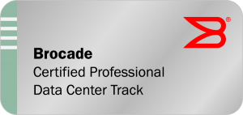

After ~49 posts on this blog on the topic Brocade the first larger block is finally complete: the Brocade Certified Professional Data Center Track (**BCPDC**)!

What's that? So Brocade has several (4) tracks which consist of  certifications/accrediations, some are shared between the tracks and some are only in one track. Currently, after completing 3 out of 4 you gets the title Brocade Distinguished Architect! Woop!

It took me ~3.5 years (counting since first blog post about BCFA (certified fabric administrator)) to complete all the prerequisites for BCPDC, but naturally I didn't do it as fast as I could. I was patient and many of the certificates I got by being signing up for Brocade's beta tests of their certs.

Not that many certificates left to take actually before I can complete another track. Most of the remaining ones are labeled accreditations, which are unproctored tests one does at home.

- For Brocade Certified Professional Converged Networking (**BCPCN**) I have 3 accrediations left (Fabric Specialist, FCoE Specialist and Ethernet Fabric Support Specialist) and 1 certification: Ethernet Fabric Professional 2013. The certification I have signed up for the free one I mentioned in an [earlier blog post](http://www.guldmyr.com/brocade-certified-ethernet-fabric-professional/ "Brocade Certified Ethernet Fabric Professional").
- For Brocade Certified Professional FICON (**BCPF**) there's one accrediation (Accredited FICON Specialist) an done certification (Certified Architect for FICON 2013) remaining.
- For Brocade Certified Professional Internetworking (**BCPI**) there's 3 certifications: Certified Layer 4-7 Engineer 2010, Certified Network Professional 2012 and Certified Layer 4-7 Professional 2013.
