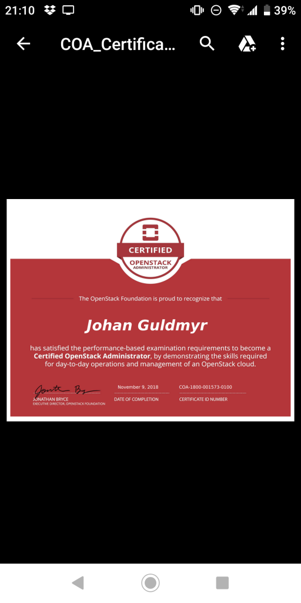

Yay! Took the exam last week after having studied a few days. Nothing seemed to be impossible from the list of requirements at least :)

Thought because it's done online it can be scheduled almost on demand, but one had to wait at least 24h for the exam environment to get provisioned.

The online proctor part was a first for me. For sure it'll help if you have a non cheap webcam (with a longer wire) that can be moved around.

The results arrived after only a day, 96% so I missed something small somewhere. Maybe about swift if I have to guess :)

I always liked these practical exams. One really need some experience with what is being tested. I don't thinn it is possible to just study. Fortunately it's easy to install a lab environment!
