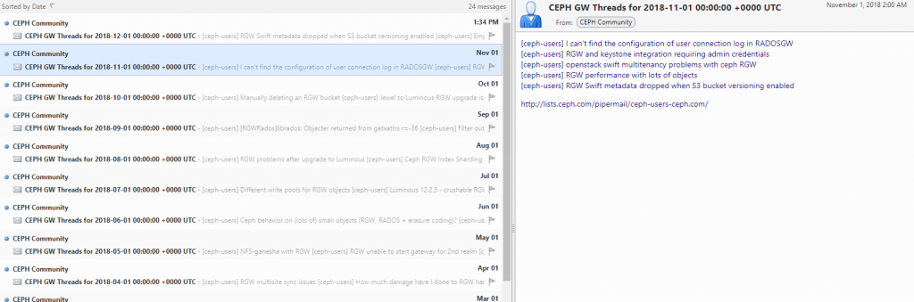

Time to try out another programming language!

Golang I see quite frequently in my twitters so have been thinking for a while -
why not give it a shot for the next project!

TLDR; [https://github.com/martbhell/mailman-summarizer](https://github.com/martbhell/mailman-summarizer)

## Why Would Anyone Ever

Took a while to figure out what would be a nice small project. Usually my
projects involve some kind of web scraping that helps me
somehow, [https://wtangy.se/](https://wtangy.se/) is one which tells me if there
"Was An Nhl Game Yesterday". Also in this case it turned out I wanted something
similar, but this time it was work related. I have been tinkering with this for
a week or so on and off. Today, the day after Finnish Independence day I thought
let's get this going!

For $dayjob I'm in a team that among many other things manage a CEPH rados
gateway object storage service. [CEPH](http://ceph.com/) is quite a big (OK,
it's quite an active) project and their mailing lists are _a decent (OK, I don't
know a better)_ places to stay up to date. For example
the [http://lists.ceph.com/pipermail/ceph-users-ceph.com](http://lists.ceph.com/pipermail/ceph-users-ceph.com)/
has lots of interesting threads. However it sometimes gets 1000 messages per
month! This is way too many for me, especially since most of them are not that
interesting to me as I'm not an admin of any CEPH clusters, our services _only_
use them :)

So the idea of an aggregator or filter was born. The mailing list has a digest
option when subscribing, but it doesn't have a filter.

## Enter "**mailman-summarizer**"! [https://github.com/martbhell/mailman-summarizer](https://github.com/martbhell/mailman-summarizer)

As usual when I play around in my spare time I try to document much more than is
necessary. But if I ever need to re-read this code in a year or two because
something broke then I want to save myself some time. Most likely I won't be
writing much more Go between now and then so the things I learnt while writing
this piece will probably have been purged from memory!

The end
result [https://storage.googleapis.com/ceph-rgw-users/feed.xml](https://storage.googleapis.com/ceph-rgw-users/feed.xml)
 as of right now looks like below in one RSS reader:



In summary the steps to get there were:

- Used <https://github.com/bcongdon/colly-example> to do some web scraping of
  the mailman/pipermail web archive of the ceph-users e-mail list. Golang here
  was quite different from Python and beautifulsoup. It uses callbacks. I didn't
  look too deeply into those but things did not happen in the same order they
  were written. Maybe it can be used to speed things up a bit, but the slowest
  part of this scraping is the 1s+random time delay I have between the HTTP GETs
  to be nice to the Internet ;)
- It loops over the Months (thread.html) for some of the years and only saves
  links and their titles which has "GW" in the title.
- Put this in a map (golang is **different** here too. Kind of like a python
  dictionary but one had to initialize it in advance. Lots of googling involved
  :)
- Loop over the map and create RSS, JSON, ATOM or HTML output using the
  [gorilla feeds pkg](http://www.gorillatoolkit.org/pkg/feeds). Use of
  the [time](https://golang.org/pkg/time/) pkg in Golang was needed to have nice
  fields in the RSS, this was interesting. Not using UNIX 1970 seconds epoch but
  some date in 2006? Some|most functions?types?interfaces? (I don't know the
  names of most things) give a value AND an error on the call makes declaring? a
  variable a bit funny looking:

```golang
for l, _ := range data {
    keys = append(keys, l)
}
```

That was the golang part. I could have just taken the output, stored it in a
file and put it in a web server somewhere.

[https://wtangy.se](https://wtangy.se) uses google's object store, but it has an
appengine python app in front. So I took a break and watched some NHL from
yesterday and in the breaks I thought about what would be a slim way of
publishing this feed. I did not want to run a virtual machine or container
constantly, the feed is a static HTML and can just be put in an object store
somewhere. It would need a place to run the code though, to actually generate
the RSS feed!

I'm a big fan of
[travis-ci](https://github.com/martbhell/mailman-summarizer/blob/master/.travis.yml)
and as part of this project the continuous integration does this on every
commit:

- spawn a virtual machine with Go configured (this is all part of travis(/any
  other CI system I've played with), just needs the right words in .travis.yml
  file in the repo)
- decrypt a file that has the credentials of a service account which has access
  to a bucket or two in a project in google cloud
- compiles mailman-summarizer
- run
  [a bash script](https://github.com/martbhell/mailman-summarizer/blob/master/tools/deploy.sh)
  which eventually publishes the RSS feed on a website. It does this to a
  staging object storage bucket:
  - go runs "mailman-summarizer -rss" and writes the output to a file called
    feed.xml
  - uses the credentials to write feed.xml to the bucket and make the object
    public-readable
  - Then the script does the same to the
    [production bucket](https://storage.googleapis.com/ceph-rgw-users/feed.xml)

One could improve the CI part here a few ways:

- Right now it uses the travis
  [script provider](https://docs.travis-ci.com/user/deployment/script/) in the
  deploy phase. There is a 'gcs' provider, but I couldn't find documentation for
  how to specify the JSON file with the credentials like with appengine. I get a
  feel that because it's not easy I should probably use appengine instead..
- One could do more validation, perhaps validate the RSS feed before actually
  uploading it. But I couldn't find a nice program that would validate the feed.
  There are websites like <https://validator.w3.org/feed/> though so I used that
  manually. Maybe RSS feeds aren't so cool anymore , I use them _a lot_ though.
- An e2e test would also be cool. For example fetch the feed.xml from the
  staging and make sure it is the same as what was uploaded.
