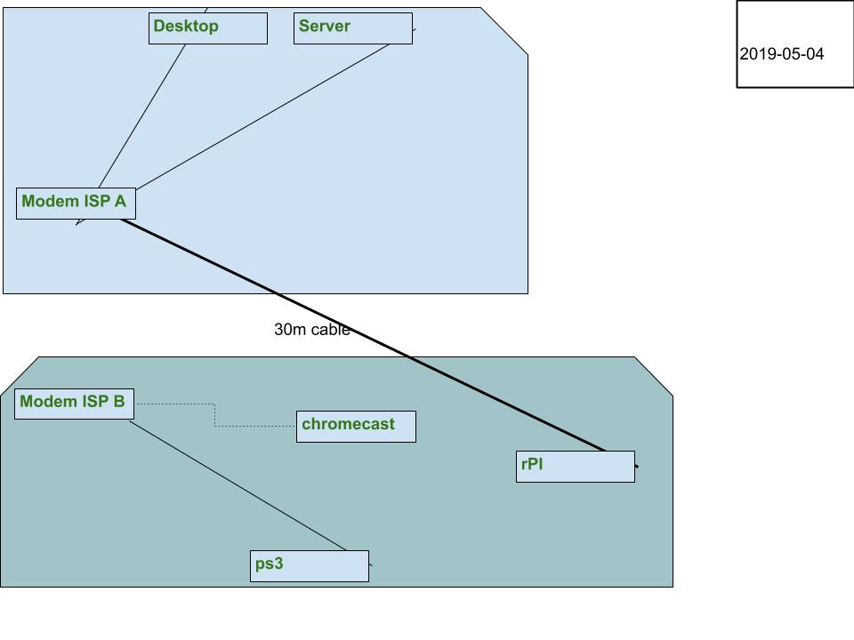

Current layout:

- The corner:
  - Cable MODEM NAT&WiFi ISP A
  - One server
  - One desktop who should be on both networks, default gw on one
  - Phones and tablets wifi
- TV Area:
  - DSL Modem NAT&WiFi ISP B
  - One raspberry pi connected to the server
  - Phones and tablets wifi
  - One chromecast, would be nice to have connected to the server too
  - One ps3
- 20m, a microwave, and walls in between the two areas (and most importantly the
  server and the raspberry pi) so wifi is spotty.

Most import factor: **One long ass 30m UTP cable connecting the raspberry pi to
the same network as the server**

It would be cool to: **A)** be able to connect the desktop to the modem out by
the TV and **B)** Get the chromecast (WIFI only) onto the same network as the
server, perhaps with an AP for ISP A network near the TV area

Stay tuned for another post in the hopefully near future when I've got something
working to help with A/B :)

Update : another graphical representation of the networks:

