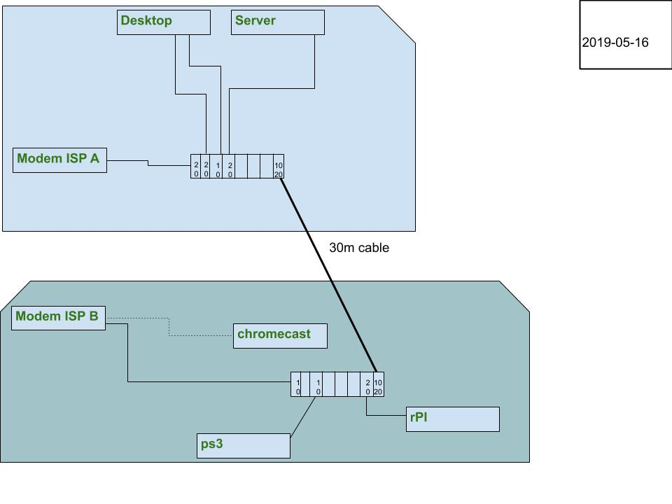
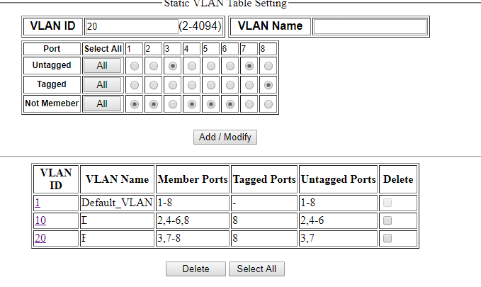
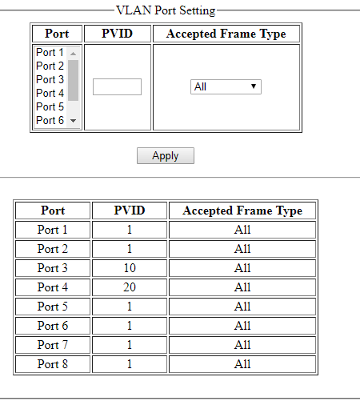

---
title: VLAN in the home network!
date: 2019-05-30
category: it
tags: cable, firmware, home, network, hyper-v, internet, service, provider, modem, network, interface, controller, network, switch, usb3.0, user, interface, virtual, lan, windows10

https://www.guldmyr.com/some-updates-to-the-home-network/

Above is a previous post in this series about some improvements to my home network. With two modems from two ISPs.

So! On Alibaba I found two Hasivo [8x1GbE managed fanless switches](https://www.aliexpress.com/item/8-Port-Gigabit-Managed-Switch-Managed-Ethernet-Switch-with-8-port-10-100-1000M-VLAN/1000007360495.html) with VLAN support. Delivery time to Finland was really quick. It didn't say (ok, I didn't read all or ask seller) if they included European adapters but turns out they did!

To recap: **The idea was to use the one long cable and transport two VLANs over it. Other than that how I would actually implement it was a bit fuzzy.**

New layout. Numbers in the switchlike boxes are VLAN ids

Things I've learnt while connecting these:

- Creating a VLAN subinterface in Windows 10 seems to require Hyper-V.. This means if I have one machine and want it in both VLANs I need two NICs. No bother, I found a USB3 1GbE adapter in a box at home when cleaning :)
- I knew about VLAN trunk cables, and the way they are implemented in this Web Interface is to set both VLANs as tagged on the same port.
    - The web interface of this switch has two pages about VLANs. One is a static setup where you say which port is a member of which VLAN and if it's tagged or untagged. Changing the default or removing a port from VLAN 1 was not possible in this the first screen. In the second however one can change the PVID which is the untagged/native VLAN.
- Also found a few extra short ethernet cables in old ISP modem boxes, very nice to have with this as this exercise required a few more cables.
- So on the desktop I now need to choose which network interface to use to get to the Internet. I learnt that if I just remove default gateway for IPv4 from ISP A and use the NIC to ISP B then IPv6 from ISP A will still be there and used :)

First VLAN config page: The static VLAN/tagged VLAN setup on the other page

Second VLAN config page: The native VLAN / PVID configuration on one switch

_Some **more bits about the switches is in order:**_

On a related note, the modems have switches builtin and I also had a 6 port fanless unmanaged switch which has been working great for the last 6 years or so but now that got deprecated, yay one less UK plug adapter :). I prefer using an extra switch as opposed to the modem's. The modems sometimes reboot which is annoying as it interrupts anything I'm doing, even if it's only local without going to the Internet.

They have a very basic looking CGI web interface. The web interface is only accessible on VLAN 1. The firmware is from 2013 and has version v1.0.3, I asked the seller (which was very responsive to all of my questions) and apparently a newer one is in the works but unfortunately, there's no way to subscribe to any news about new firmware coming.. I doubt it'll ever come.  
  
One switch-like quality was that to save the running configuration you make in the web interface, you have to click on save.

There is a manual, one just had to ask the seller on Ali Baba for it :/

All in all this worked out quite nicely. We'll see how this keeps up. Some further avenues of interest:

- On my desktop I now use the USB NIC to get to the internet, I tried once to use the system board NIC but then had some issues.. perhaps that's a bit faster. Using a USB 3 port vs a USB 2 port gave about half a millisecond faster latency to this place I usually ping.funet.fi
- Response time on the DSL is a bit higher (17 vs 12) to ping.funet.fi
    - tracert shows 17ms to first hop with the DSL's ISP
    - tracepath shows 10ms to first hop with the cable modem's ISP
    - pinging the DSL modem is 1ms vs cable modem 3ms
    - ping6 to ping.funet.fi is 10ms with DSL
- Maybe time to look into a cheap AP to plug in near ISP modem B but connected to VLAN 10 so wifi clients there can reach the server..
- The switches have a bunch of other settings that could be fun to play with too.

Was the layout diagram above not clear? Try this:

