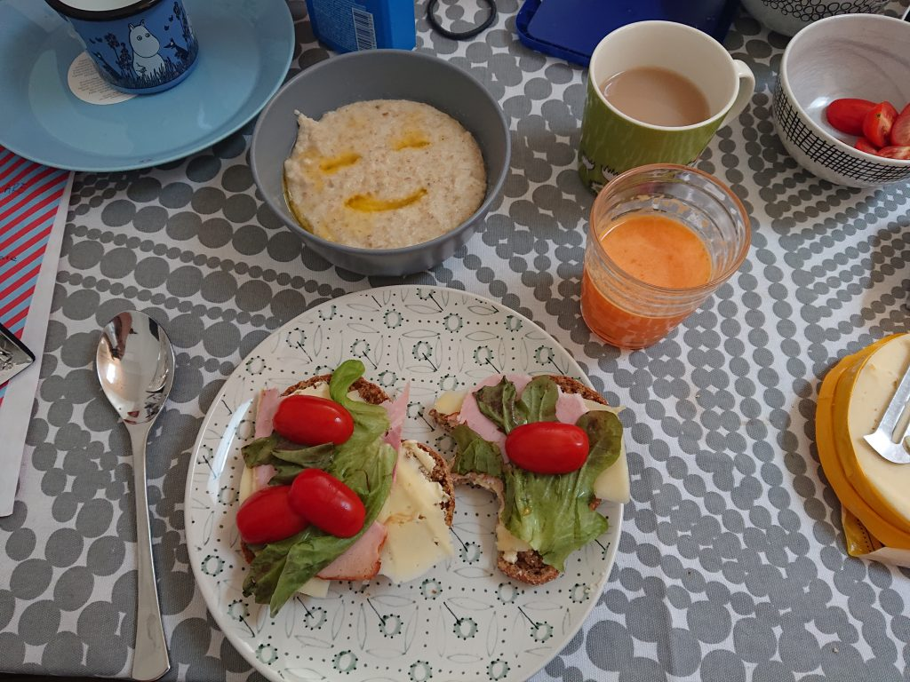

---
title: "Resepti: Puuro"
date: 2019-11-16
category: finland

Kahdelle

3dl vettä ja 3dl maitoa. Vispata ja kun höyry tulee ottaa lämmöt allas. Laitta 4x 3/4dl (12/4 vai 3dl) hiutaleita (esim kaurasta tai neljänviljasta) skuupat. Kun on melkein valmis lämmöt pois ja lautta suola.

Laittaa puuron kulhoihin, laitta voita keskellä ja silloin sokeria.

Tadaa :)

