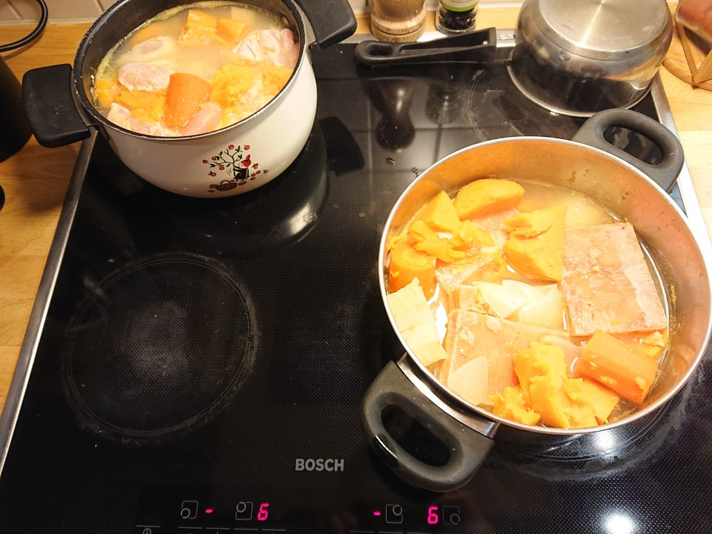

Ota pakasti lohta pakastimesta.

- 3 bataatia
- 1 palsternakkaa
- 3 porkkanaa
- 1 sopuli
- 2 valkosipulinkyntä

Laita kaikki kahteen kattilaan. Joka painee noin 800g. Vesimäärä tarvitset on
'niin paljon että se menee yli ruoan'. Keitä ruoka.

Kun se in valmis laita 400g lohta yhteen kattilaan ja 400g kanaa toiseen.

