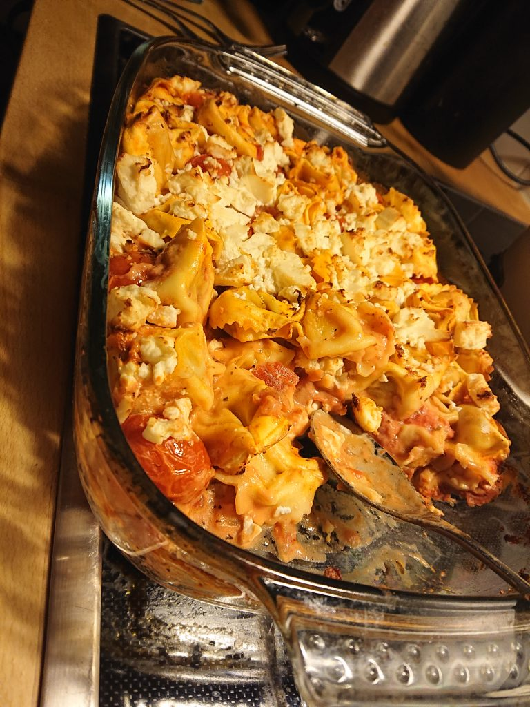

- 2x tortellini 250g
- 1x kirsikka tomaatia
- 1x tomaatia murska yrtejä
- 1x ruokakerma 10%
- 1x feta juusto
- suola ja pippuri

Miksata kerma, tomaatimurska ja mausteet. Kaada sose formille jossa on jo tortellinia ja tomaatia. fetajuusto päällä. Uunille 200 ℃ ~18min.

Versiolle kaksille: ehkä parempi rikottajuusto, penaati ja ilman tomaatimurska?

