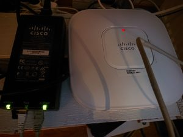

---
title: AIR-LAP1142N-E-K9 to autonomous Mode Adventure
date: 2020-02-19
category: it
tags: aironet, cisco, ethernet, https, ip, lap1142n e k9, network, vlan, wifi, wlan

> ## [](https://www.guldmyr.com/wp-content/uploads/DSC_1469-scaled.jpg)

## Some initial needful information

- Reset is done by holding MODE and then powering off and on the device
- Default enable password is Cisco
- Serial ttyUSB0 worked with one usb to rs232 and then a serial to RJ45 adapter, my cheapo ebay USB to rj45 did not work. The colors of the wires are different..
    - working: LL977744 CSA AWM and a "pl2303 converter" Prolific Technology Inc on ttyUSB0
- Firmware c1140-k9w7-tar.153-3.JD17.tar found on twitter with checksum d96702caf75442f01359aa9a6cb70d19

While the AP is in non autonomous mode you need to run a debug command to get the conf t: _debug capwap console cli_

To change it from using a controller to autonomous mode you need to load a firmware that is like that. The one I got had a firmware loaded that wanted to talk to a controller.

- While looking in serial log indeed the firmware on the AP was "w8" at the end == needs a WLC
- tried to first setup a TFTP server and open firewalls and reboot the access point while holding the mode button (you need to hold it for a long time, like 27s) - it tried to fetch the image from tftp://255.255.255.255/ but didn't work / timed out..

## Hunt goes on:

These release notes got me a bit worried: [https://www.cisco.com/c/en/us/td/docs/wireless/access\_point/ios/release/notes/aap-rn-83mr5.html](https://www.cisco.com/c/en/us/td/docs/wireless/access_point/ios/release/notes/aap-rn-83mr5.html)

Conversions from an 8.0 Wireless LAN Controller unified release AP image to autonomous 15.3(3) k9w7 image will get aborted with a message “AP image integrity check failed.” To overcome this, load any previous autonomous k9w7 image and then upgrade to the 15.3(3) JAB k9w7 images. **If this is the same as LWAPP version I had was 7.3.x** _so the above did not apply._

[https://greenwhitehat.blogspot.com/2017/08/how-to-configure-cisco-access-point-air.html](https://greenwhitehat.blogspot.com/2017/08/how-to-configure-cisco-access-point-air.html)

[https://www.fragmentationneeded.net/2010/08/tftp-oddities.html](https://www.fragmentationneeded.net/2010/08/tftp-oddities.html) is talking about changing listening address to 255.255.255.255 instead of 0.0.0.0 ..

## secret sauze

- setup static IP on your linux computer, **_make sure to not just "ip addr add ip/24 dev eth0" because you might still have NetworkManager with DHCP that might revert those changes_**
- setup a dhcpd that has 10.0.0.5 10.0.0.7 range or some such
- setup a linux tftp.service - if you want "--verbose --address 255.255.255.255:69" to the tftp.service CentOS7 edit that file in systemctl cat tftp
    - Not sure if needed but maybe it was useful
- systemctl start tftp dhcpd
- sysetmctl disable dhcpd tftp
- make sure to let UDP(& TCP?) 69 through the firewall
- next is to connect the console and login to the AP and run some commands:

```
$ ena
# conf t
# debug capwap console cli
# archive download-sw /force-reload /overwrite tftp://10.0.0.2/c1140-k9w7-tar.153-3.JD17.tar
```

- _Before you disconnect the ethernet cable to the AP, do stop and disable dhcpd and tftp to prevent running some extra dhcp server in some office network._

## Configuring it

Easiest is probably to use the http on http://IP:80 to configure it

Username/Password: Cisco/Cisco

[https://www.cisco.com/c/en/us/td/docs/wireless/access\_point/1140/autonomous/getting\_starte d/guide/ap1140aut\_getstart.html](https://www.cisco.com/c/en/us/td/docs/wireless/access_point/1140/autonomous/getting_started/guide/ap1140aut_getstart.html)

There's the express setup and I used these settings:

- Only configured the 5GHz
- Set a short SSID and enabled broadcast beacon
- WPA2-PSK key
- Disabled universal admin
- Set VLAN 5 and native VLAN

Other changes:

- Enable the radio (no shutdown on the interface or in the web ui)
- Create a new user/change default passwords of Cisco user to make it a little bit harder for things to pwn it
- Set clock
- Change hostname and set a banner login banner
- copy run start

One could enable https, but that used a too weak key by default so I just left it at http. In any case make sure to set the clock before enabling https.

## Some extremely useful links

Previous post in this blog about my home network: [https://www.guldmyr.com/home-network-convergence/](https://www.guldmyr.com/home-network-convergence/)

[https://community.cisco.com/t5/wireless-mobility-documents/lwapp-to-autonomous-conversion-and-vice-versa-on-access-points/ta-p/3121542](https://community.cisco.com/t5/wireless-mobility-documents/lwapp-to-autonomous-conversion-and-vice-versa-on-access-points/ta-p/3121542)

[http://wiki.r1soft.com/display/ServerBackup/Configure+a+TFTP+server+on+Linux](http://wiki.r1soft.com/display/ServerBackup/Configure+a+TFTP+server+on+Linux)

[http://exchange2013pikasuoh.blogspot.com/2015/08/convert-cisco-air-lap1142n-k9-to.html](http://exchange2013pikasuoh.blogspot.com/2015/08/convert-cisco-air-lap1142n-k9-to.html)
