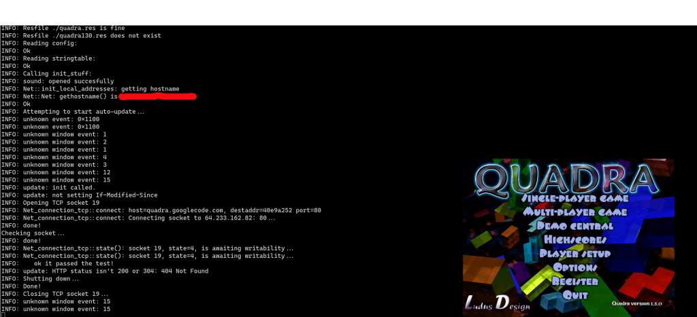

---
title: Quadra - Did You Play It?
date: 2020-02-06
category: it

In my youth I enjoyed the LANs. One fun game we played was Quadra - which is a multiplayer tetris where by playing the game you send more blocks to your opponents making it very stressful :D

[https://github.com/quadra-game/quadra](https://github.com/quadra-game/quadra) turns out it is open source and it's out there!

Does it still build?

CentOS 7.7:

```bash
$ sudo yum install git
$ git clone github.com/quadra-game/quadra
$ sudo yum groupinstall "Development Tools" 
$ sudo yum install SDL2-devel boost-devel libpng-devel
$ cd quadra
$ autoreconf -i
$ ./configure
$ make
```

**It DOES!**

Does it run!?

`$ QUADRADIR=. ./quadra`

And I get a very nice window :)



Quadra in 2020! (do note that it tries to talk to google and sourceforge for updates and so on, try the ./configure --disable-version-check)

I could even launch one process to run a server and then another server and connect to localhost :) So multiplayer must sureley durely work!

It's a big laggy - I recall it being very snappy because I was da bomb at this game :)

I blame this on that I might have missed some dependency and it now fell back into some easier something and or maybe the graphics card in this laptop is not good (maybe it's too new? It's a Skylake GT2 HD G 520).
