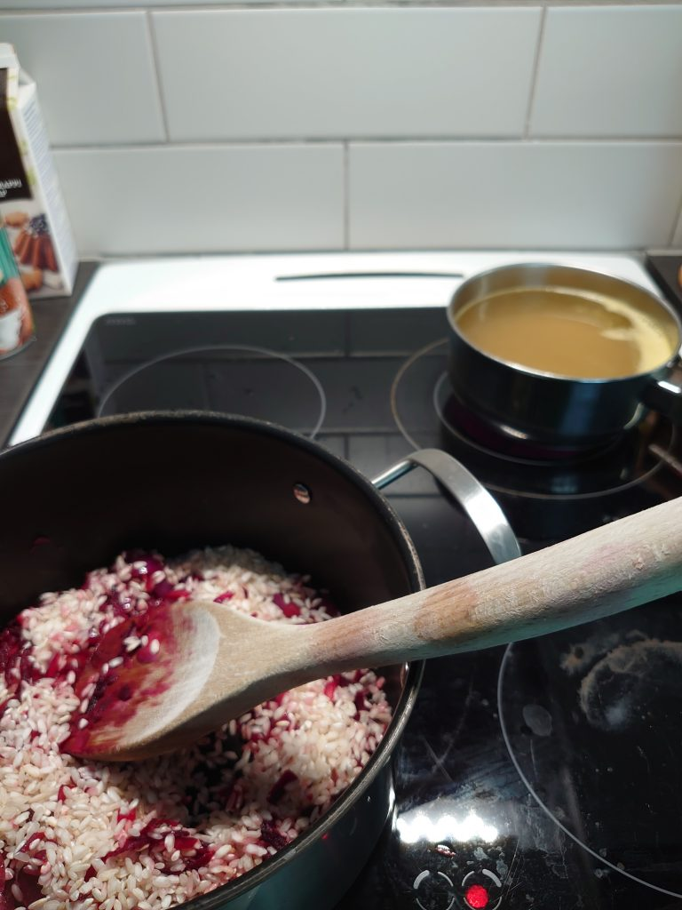
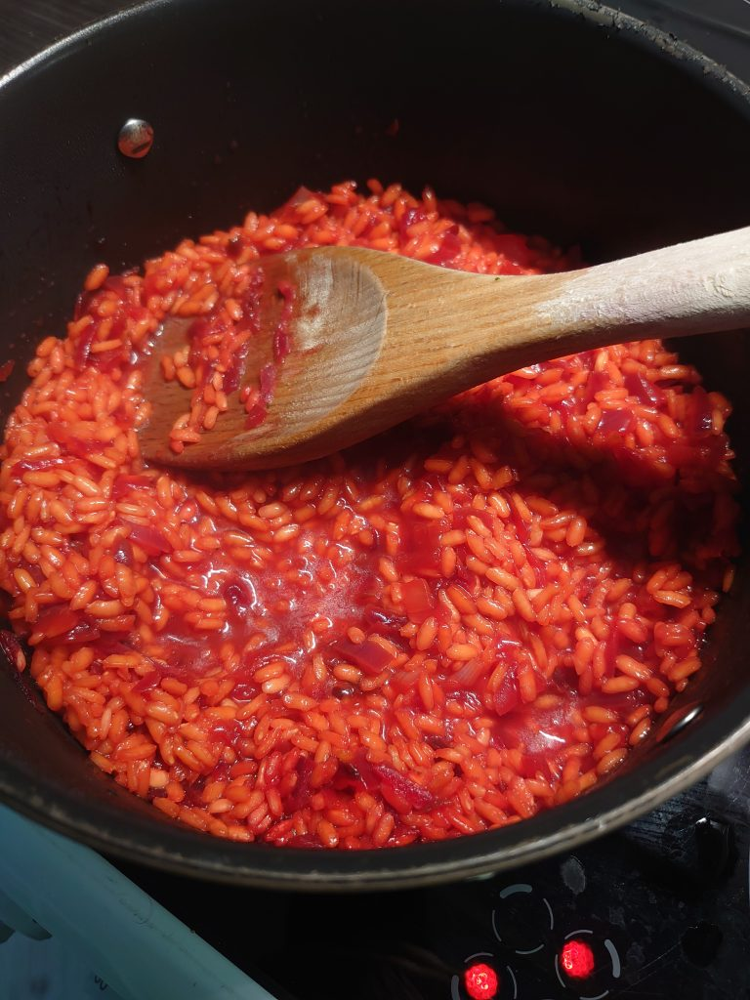
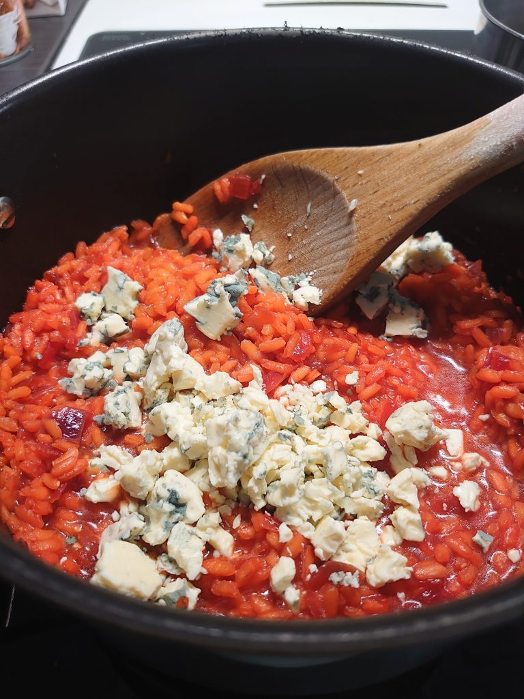

ainesosat:

- 1x punasipuli
- 1x Punajuuri
- Risottoriisi
- Liemikuutio
- Aurajuusto

raaste punajuurea, paistaa sipulia öljyssä, laitaa riisi samassa kattilassa ja lisätä liemikuutiovesi hieman ja hieman.

Lisätä vesi kun se on vaan vähän märkä.

Kun riisi on valmis (ei liian pehmeä vai kova) laitaa puoli aurajuusto sisään.

