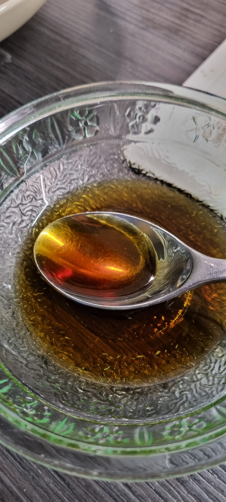
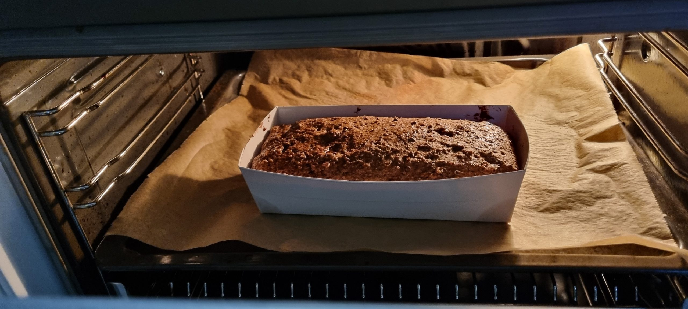

---
title: saaristoleipä
date: 2023-01-18
category: finland
tags: baking, leipa, recipe, resepti, reseptit, saaristolaisleippa

yritys 1:

- tuoppi saaristolaisleippä valmis paketti :)

- Lämmittää 2.5dl vesi 42c astetta

- Sekoittaa kuiva hiva ja jauhetta

- öljyä paistovuoan (kartonkinen tuki mukaan)

- sekoittaa vedellä

- laittaa vuokaan

- Viltti päällä ö, laitta lämmin paikalle ja odottaa 45min

- Uuniin 175c (vaan Mercedes vihta) 50-60minuutia

- 15min ennen valmis penseloida vesisiirappi (1rl siirappia ja 3 rl vesi)

- anna se aika viilee

- leikkaa

uunissa: 

jälkeen: 

yritys 2:

- silikonilla vuoalla

- öljytä vuoan parempi

- aloittaa aikaisemmin että se saa enemmän aikaa viileää

- laitta enemmän siirappia päällä :)
