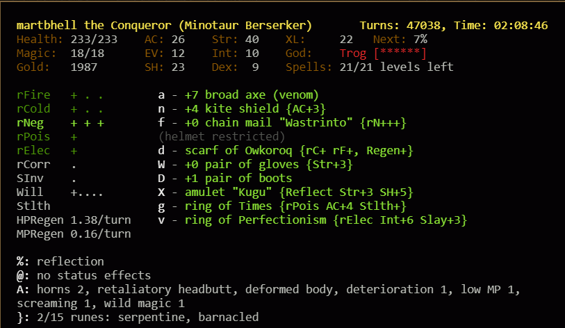

0.30 Tournament
===

Timeline of the 2023 May 0.30 tournament - continuing off from [Part 1](dungeon-crawl-stone-soup-030-tournament).

Try to win first with my usual MiBe. Each bullet is roughly 1 or a few deaths.

- Found a heavy broad axe. Made it to end of lair, but then learnt quickly that heavy is very bad against an enemey that's quick and have a weapon of speed!
- Next round got a pretty fun Hand Axe early with +9 and shout. But died early to Gnolls..
- Gnolls again. They are bad.
- "Let's drink some mutation potions". It'll be fun they said. (clumsy and rf- on first..)
  - But have made it quite deep down! Have RN+++ and doing axe + shield. Got a venom broad axe and an antimagic war axe for the mages.
  - There is a manual of axes though that I could buy. Get quickly to 24 if I get an execution axe? There are some nice shields and battle axes lying around too.. :S :S :S :S :S
    - maybe get it early and train a bit towards just in case?
  - Chose abyss over slime beacause I didn't have any good rcorr and had RN+++. Died right next to the abyssmal rune because I got a mutation that didn't allow drinking any potions and got poisoned :D:D Fuuuu

Plenty and plenty other deaths after this during the week. Died for many Fun reasons:

- ran out of intelligence
- possibly too little dodge?
- no rpois anywhere??? and swamp and snake branches??
- I have RC++ what could go wrong??

