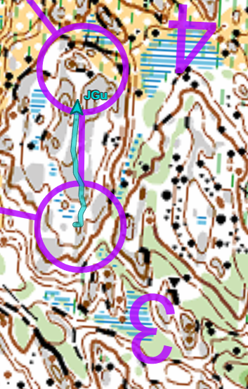
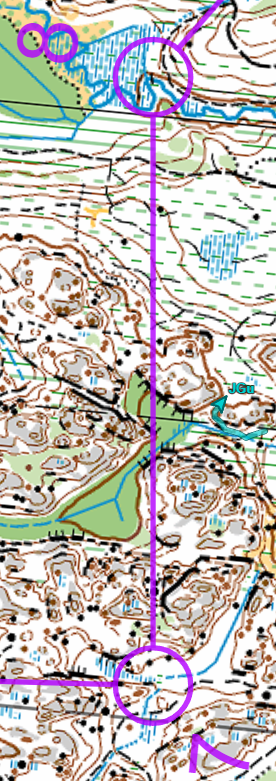

Suunnistaa
===

 - Lohko: E
 - 4.0km (juoksin 5.0km, 53min, 16/108)
 - Sorvalampi
 - [Livelox](https://www.livelox.com/Viewer/Firmaliiga-2023-kevat-2-kisa-Royla-Sorvalampi/E?classId=604983)

Miten
===

  * K-1: tien kautta. Otin suunta avakalliolta
  * 1-2: menin liikaa oikealle, sen jälkeen vähän matka tiellä ja sitten ylös. Aloitin etsimään liian aikaisin, oli ylämäki ehkä se oli syy.
  * 2-3: tien kautta aika pitkä matka ja otin suunntaa jyrkännesta "hammalla" 
  * 3-4: tä oli aika hauska. Menin ylös ja päällä ja näin nuo kaksi "sormeja" missä juoksin välillä. Ihan suora.

  * 4-5: menin hakkuualuen yli (meni aika nopeasti, tuo vihreä oli tosi hidas ja emitin rannekke meni auka keskellä eli siellä päitisin pysähtyä ja korjata). Mäen yli ja avokallion näin ja myös näin kumpare.
  * 5-6: menin suoraa mutta heti tuli tunneet että "tä oli liikaa" kun kävelin avokallion päällä, mutta löysin rastin anyway aika helposti.
  * 6-7: juoksin kaikki ympäri. Mennä suora olisi myös hyvä vaihtoehto. Lösin se myös aika helposti ja "tiesin" että "se pitäisi olla tuo kumpare toisella puolella.
  * 7-8: uhhh. okay oikealle. Tällä tuli bummi kun känsin vasemalle liian aikaisin mutta houmasin ja lösin aika ok reitti ja tuo valea vähän vihreä alue oli aika nopea. En nähnyt että 8 oli silta! Hyppäsin puron yli vähän vasemalle. Ja katsoin mäet missä olin. Tulin liikkaa vasemalle.

  * 8-9: no, oli enemmän ylämäki kuin arvasin ja meni aika hitaasti ja unohdin vähän missä olin.
  * 9-maali: no juoksin väärää suuntaa vähän aika mutta huomasin. Ehkä olisi parempi jatka matka yli kääntä takaisin tielle..

Oli niin hauskaa olla takaisin firmaliigaan. Tunsin kuin karhu metsässä!
