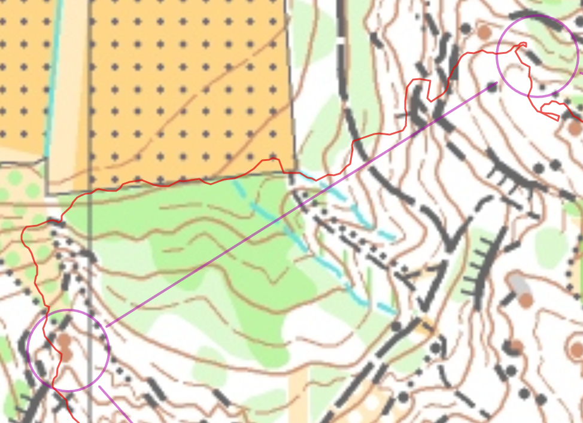

Mitä?
===

Yritän kirjoittaa allas miten se meni tämä kertaa ja mitä oli vaikea ja miten meni väärin.

 - A
 - 6.3km (juoksin 9.6km, 2h2min)
 - Leipsuo

Miten
===

 * K-7: ihan sekaisin osa.
   * K-1: uhhh tosi monta kiviä, en tienyt missä olin yhtään siellä avakalliolla. 13min. Yhden sijaintin parempi minulta oti 4.5min.
   * 2-3: katsoin maailmankuppi ja luulin että "mä juoksen polkulla ympäri". En jaksanut juosta mäen alle, ja se oli mun mielestä hyvä idea. 17min. 12:09 oli toiseksi viimeinen.
   * 5-6: sama idea kuin 2-3. Juoksin ympäri ja se kesti 22:28 min. 17:20. Yksi ongelma oli etä yritin ota suunta yksi kumpare siellä pentolta mutta en tehnyt se kärsivällistä. Juoksin liikaa oikealle.
   * 6-7: tä meni niin hyvin! Suora linjalla. Näen avokallio puiten välillä ja näin hyviä seuravia tavoitteet koko ajan.

 * 7-8: parempi, en yritänyt mennä jyrkännen välillä. Kartalla oli ilmeisesti väyliä mutta juoksin vähän enemmän ylämäki.
 * 9-10: parempi! Otin suora reitinvalinta - ja se oli nopeampi paitsi se meni vaaleavihreäaluen kautta.

 * 10-11: ai mitäs nyt. Unohdin usko itseleeen. Tällä oli nyt monta muita suunnistajia ja otin seura. En pitäisi otanut. Joo, löysin se mutta se oli ihan onni että joku muu suunnistaja oli matkalla samalle rastille. En ollut kartalla yhtään. Fokus lähtenyt myös tällä. Olin kylmä koska se satoi koko ajan ja väsyttää ja tunsin polvet :D
 * 11-12-13-14-15-maali: aika OK tulokset (edeleeen viimeinen, mutta ei niin pahasti takaisin)

