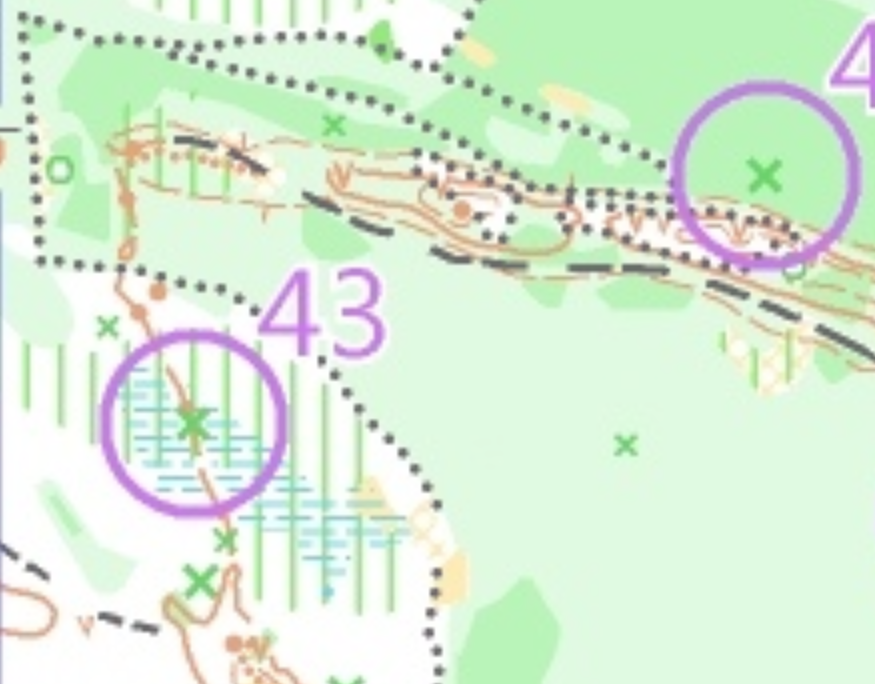
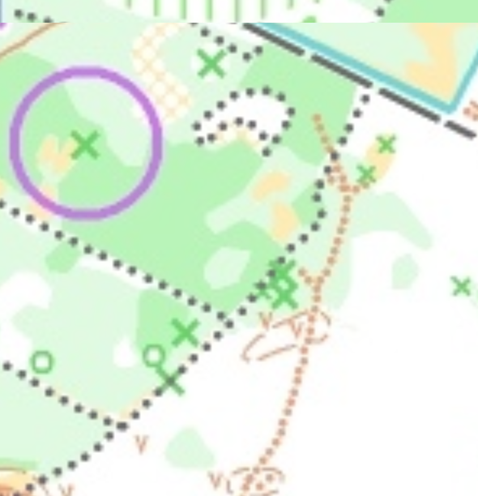

Magnets 47
===

 - Lohko: M21AK
 - 6.5km (juoksin 9.5)
 - 22 rastia
 - Ložmetējkalns, Latvia
 - [reittihärveli](https://www.magnets.lv/routegadget/cgi-bin/reitti.cgi?act=map&afrom=0&atype=0&atime=0&aspeed=1&zoom=20&dim=1&id=1305&cID=5&aID=50149)!
 - [tulokset](https://www.magnets.lv/rezultati/vasara_2023/47_karta/results.htm#M21AK)

yleisesti
===

 - Oli aika hauska että siellä oli vihreät äksät - se olivat kattuneet puita ja toimivat minulle myös kuin "pysähty"-merkki (että olin juoksunut rastin ohi). Aika montta rasteja oli tässä äksässä.
 - Niin monta rasteja, eli se meni aika helposti.
 - Paljon hiekka! Tosin kuiva maasto.
 - 0 kivejä kartassa!
 - tosi monta `V` (kuoppa) mutta en tiedä, olivatko ne ihmisen tehtneet?
 - tumma vihreä oli oikeasti tumma ja melkein mahdotonta mennä siiden kautta. Valea vihreä ei oli niin paha mutta tosi huono näkyvys.
   - muutama rasteja oli piilotettu noin 15m sisään tummaaan vihreään. Aika vaikea mennä sinne ja myös vaikea oli lähtö yksi niistä. Hokasin täydellisesti suunta kun lähtin tuo tummalta vihreältä.
 - Kiinostava oli yksi merkki ja se oli tosi "ohut" ja suora korkeus-ero linja, joskus se oli kaksi linjaa jos se meni vähän leveämpy mutta muutama kerta se oli vaan yhden.

 - myös yksi ruskeo pistetty polku en ole paljon nähnyt

 - muutama mäkejä oli ehkä vaikein, niin monta kuoppaa mäessä oli vaikea löytää just missä kuopassa rasti oli
 - sain numero ja lappu ja saan säästä se!
 - lapsi myös tuli mukaan ja tykkäsi
 - en nähnyt niin paljon ihmisiä kun juoksin mutta paljon autoja oli siellä "Parkissa" kun lähdin.
   - myös hyvin järjestetty parkkialua. Se oli pitkä "alua", metsä tien sivulla. Tulit yks suunasta ja lähdit toiselta.
