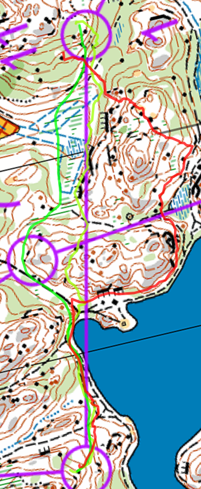

Suunnistaa
===

 - Lohko: d
 - 4.5km (juoksin 6.7km, 90min, 64/73)
 - Velskola
 - [Livelox](https://www.livelox.com/Viewer/Firmaliiga-2023-syksy-1-kisa-Velskola/D?classId=644526&tab=player)

Miten
===

  * K-4: mäen ympäri, juoksin liikaa allaspäin, tielle. Aika hyvin
  * 4-5: järkyttävä iso bummi. Sunnitelma oli juostaa metsällä järveen polku ja juostaa ympäri. Vaikeus ehkä tuli koska aloitin katsoa järveen ja yritin käyttä sen missä olin ja ilmeisesti oli vaikea arvioida missä olen sen mukaan. En katsonyt tarkasti eteenpäin, luulin että olin liikaa. Yksi lisä vaikeus oli että kartta oli 10000:1 - jostain syystä tuntui pidempi kuin yleensä. Olin väsynt ja en ollut treenanut juoksu riitäväks paljon kesällä.
  * 6-10: sain nämä kaikki kiini hyvin (rastiväl olin noin 45~). Juoksin myös lähellä yksi muu juoksija tällä, meillä oli noin sama temppu.
  * 10-11: seurava iso bummi. Minulla ei ollut hyvä sunitelma ja lisäks valitsin reitti mikä tuntui varmempi - ympäri ja polulla mutta kun tulin lähellä ei ollu varmempi. Varmasti mennä suorempi olisi paljon nopeampi.
  * 11-12: menin ylös liian aikaisin (siellä oli joku toinen radan rastti).

  * 11-12: menin ylös liian aikaisin (siellä oli joku toinen radan rastti).

Lopussa
===

Mutta lopussa oli tosi hauskaa olla takaisin metsässä ja firmaliiga. Velskolla oli remontti ja saimme limosiinikuljetus Luukista :D

Firman joukkue oli D-lohkossa koska voitimme E-lohkossa kevällä. Katsotaan jos se menee parempi meille seurava kaksi vuoroa!
