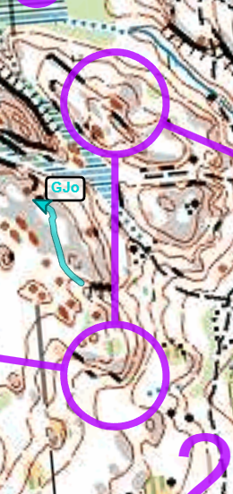

Suunnistaa
---

- Lohko: d
- 4.5km (juoksin 5.9km, 67min, 56/87)
- Haukkalampi
- [Livelox](https://www.livelox.com/Viewer/Firmaliiga-2023-syksy-2-kisa-Haukkalampi/D?classId=648305&tab=player)

Miten
---

- K-2: Tuntui hyvältä ja juoksin suoraan.
- 2-3: Käännyin liikaa vasemmalle ja enkä löytänyt väylää suolle, joten pyörisin siellä aika pahasti. Menetin noin 4 minuuttia. Juoksin aika kovaa K-2 välillä, joten harkitsisin ehkä hieman rauhallisempaa vauhtia.
- 3-4: En tarkistanut kartasta mitä tulee ja juoksin suoraan jyrkänteen ja tarvitsin juosta takaisin ja ympäri siitä.
- 4-5: Pidempi väli, nautin tästä, ja olisi hyvä sunnitella seuraava rastiväli tarkemmin.
- 5-6: Pitkä väli, pysähdyin muutaman kerran miettimään reittiä. Juoksin polulla liian pitkään. Ehkä parempi olisi valita suoremmin ja hyökätä lähempää rastia, jolloin olisin voinut välttää ison ja helposti tunnistettavan kohteen. Myös korkeuserot olivat suuret, ja vaikka vasemmalla oleva polku oli lähellä lampea, se vei minut paljon ylös ja alas. Löysin kuitenkin rastin suhteellisen helposti.
- 7-8: Valitsin oikeanpuoleisen reitin, mutta alueella oli paljon kaatuneita puita, mikä hidasti etenemistäni. Vasemmalla olisi ollut parempi vaihtoehto, sillä siellä oli polku.
- 8-9: Korkeuseroa piti ottaa huomioon ja pysyä korkealla; alasmeno ei ollut paras vaihtoehto.

Lopussa
---

Hyvä tunnelma. Meni paljon paremmin kuin viime viikon kilpailussa.
