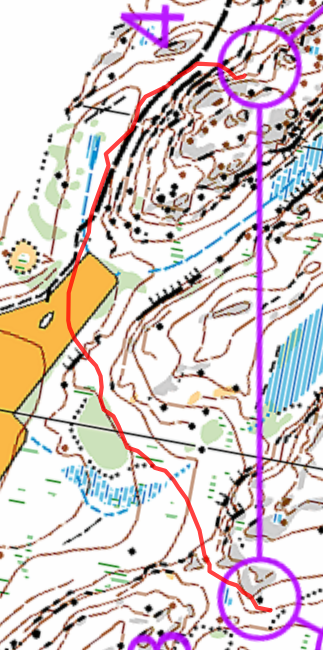

Suunnistaa
===

- Lohko: d
- 4.5km (juoksin 6.2km, 67min, 53/80)
- Letku, Salmi
- [Livelox](https://www.livelox.com/Viewer/Firmaliiga-2023-syksy-3-kisa-Salmi/D?classId=656177&tab=player)

Miten
===

- K-1: Tuntui hyvältä ja juoksin suoraa rastiin.
- 1-2: Halusin mennää avokalliolla, näin kuutosen rasti mutta meni sen jälkeen liian oikealle ja ei pitää korkeusero kuin halusin. Näin tuo vihreämpi alue mutta en uskonut että se oli siitä ja juoksin vihreä alue ja rastin ohi.
- 3-4: Ehkä paras. Kiersin mäkeä ja juoksin pellon yli ja iso tiellä.
- 4-5: "pitää korkeusero!" oli mun päässä, ja meni aika OK.
- 5-6: Suora vaan, ei oli mitään mitä voin otta kiini. Pysähtyin liian aikaisin ja vasemalle. Pitäisin huoammnut että avokalliot lopuneet.
- 6-7: Tä tuntui myös hyvältä, otin suorempi ja vasen reittivalinta. Pysyin linjalla aika hyvin koko ajan mutta löysin jonkin muun rastin ennen mun ja se oti ehkä minuutin.
- 7-8: Suon yli! Nyt tuli hienot märkät kengät! :D Myös tällä ei oli jotain mitä voin seuraa koko matkan. Vähän matka käyttää yksi kohte, sitten vaihtaa toiseen.
- 8-9: En huomannut tuo polun, olisi autannut jos sunniteluin reitin hieman enemmän tällä
- 9-10: Tuntui hyvältä. Näin nuo pienet mäet myös metsässä
- 10-11: aika nopea
- 11-12: Ai mikä bummi. Tosi paljon liikaa vasemalle. Näin että tä oli keltainen, mutta en katsonut tuolla aluella kartalla (myös koska se oli alle nro 12 :D). Kiersin melkein maaliin ja ylös rastille ja takaisin. Bah!

Lopussa
===

En tarvitsinut syödä banaanin just ennen juoksun. Olisi parempi odottaa ja ottaa se jälkeen. Mutta hyvä että otin juomarepun mukaan tämän kerran, kun tuli kävelly (korkea mäki) sain vähän juoma juottu ja otin se vähän rauhallisempi ja antoi enemmän aika tarkistaa kartan ja reitin.
