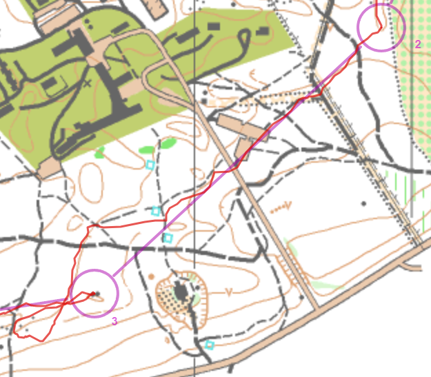

## Suunnistaa

- Lohko: b
- 5.4km (juoksin 6.4km, 56min, 28/31)
- Kiljavannummi, Sääksi, Nurmijärvi
- [routegadget](https://rajamaenrykmentti.fi/kilpailut/reittiharveli/cgi-bin/reitti.cgi?act=map&id=157&cID=7&pID=50150)
- [tulokset](https://rajamaenrykmentti.fi/irtulokset2023/v20231017yo.html)

## Miten

- K-2: OK
- 2-3: Isoin bummi. En valitsinut parempi otaminen olisi löytää tuo talo / mäki
  just ennen rastia ja mennä sieltä rastiin.
- 4-5: En katsonut kompassi tarkasti. Oli parempi jos menisin enemmän vasemalle.
- 5-6: Menin liikaa mäen alle. Silti tä oli mun paras rasti?? 16/31 ??
- 7-8: OK mutta ei uskonut mennä mihin muut olivat siellä eli meni rastin ohi.

## Lopussa

Yösuunnistus vinkit:

- Kun suunnistaan muun kanssa, muistakaa sovitta loppuaika ja että kaikilla on
  kaikien puhelinumerot.
- Itse en ymmärtää miksi en laitaa lampun asetuksen; että näen pidempi.. Mutta
  se heiastaa kartasta.. Ehkä minus ja en pitäisi käyttää muovipussi.
