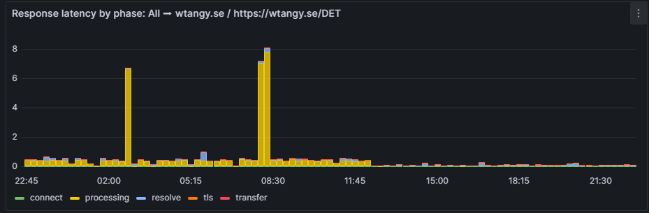
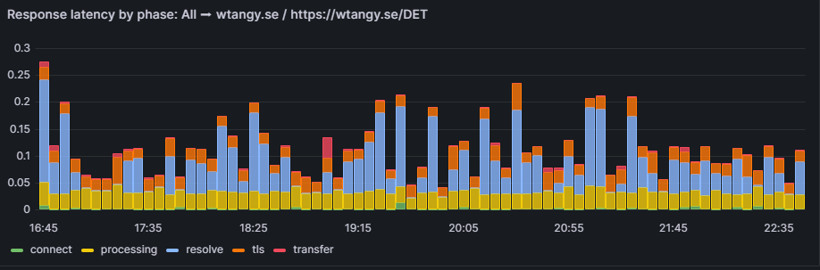

Have you seen these error messages before?
```
10:22:23.481686Z Exceeded hard memory limit of 384 MiB with 400 MiB after servicing 3 requests total. Consider setting a larger instance class in app.yaml.
10:18:23.473577Z Exceeded hard memory limit of 384 MiB with 393 MiB after servicing 7 requests total. Consider setting a larger instance class in app.yaml.
```

I saw these with:

- Google's AppEngine and a Python Flask webservice. 
- Wanting to stick with Free Tier (and dynamic instance **F1**).

I should not have used the default gunicorn settings of 4 workers, but rather follow their [guidance](https://cloud.google.com/appengine/docs/standard/python3/runtime#entrypoint_best_practices) and use 2!

Massive speedup seen, from always >300ms and frequently over 5 seconds to respond, it's now down to just a few milliseconds. Probably because the instance was I guess using all the memory. But when memory really was exceeded the app was killed and restarted resulting in even higher latency.

## before
[](images/wtangy_before.png)
wtangy_before.png

## after

[](images/wtangy_after.png)
