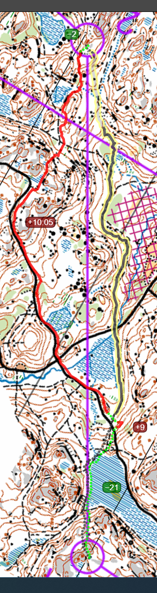

## Suunnistaa

- Lohko: c
- 4.925km (juoksin 5.92km, 65min, 70/99)
- Solvalla, Espoo
- [Tulokset](http://online.helsinginsuunnistajat.fi/63073b75-3939-4c7f-919c-3a732b3e47eb/results/231daae1-4040-4021-ac38-9bdd27967afe)
  [Livelox](https://www.livelox.com/Viewer/Firmaliiga-Solvalla-Meerlampi/C?classId=763035&tab=player)

## Kuvaus

Ekä firmaliiga ja metsäsuunnistus tänä vounna.

## Rastivälit

- K-1: Ylös ja eteenpäin. Näin se jyrkänne ja juoksin sen varrella.
- 1-2: Parasta tulosta 45/99! Pisin rastiväli. Yritin ota reitti missä oli
  varmempi rastinotto. Oli niin pitkä juosku ja korkeat nousut. Tiimikaveri oti
  matalampi reitti mutta, se meni kielettyn aluen lähellä ja minusta se tuntui
  vaikeammalta kun saavuin lähempi rastia. Tosi hyvä juttu oli että sain aika
  katsoa kaikki rastiväliä vähän etukäteen.

Minä olen vihreä/punainen reitti, toinen reitti on yksi random suunnistajasta
jotka sain sijoitus 31 muttä hänelle se kesti 13:07 min ja minulle 13:56.

- 2-3: Okei menin liikaa linjasta pois vasella puollella.
- 4-5: Pitkä reittiväli. Voisin otannut lyhyempi reitti suon yli mutta en tehnyt
  sitä. Miksi! Suot ovat kivoja! Liveloxissa näyttää kuin juoksin kiellettylla
  aluella. Se oli tosi lähellä jos en tehnyt sitä. Hauskin oli kuin näin se
  "nenä" metsässä mutta olisi parempi ota varmempi reitti ei lähellä kielletyn
  aluen.
- 5-6: Myös pitkä. Luultavasti juoksin myös tällä kiellettylle aluelle, huomasin
  mutta kyllä oli liian lähellä. Se nuosu ennen rasti oli _korkea_.
- 7-8: Kiva! Halusin juostaa isolle tielle ja kääntä oikealle myöhemmin, mutta
  kun saavuin: 1. en enää ollut varma mistä tulen pois metsästä. Ja 2. monta
  muut suunnnistajaa tuli metsältä, eli luulin että hei ehkä minun rastini on
  myös sinnepäin; se ei ollut! Anywei huomasin, että menin sisään liian aikaisin
  ja löysin metsä ja myös näin yksi sunnistaja missä oli edessä minua kun
  jonottiin lähdössä.

## Lopussa

Sain paikka CSC:n joukuessa, tosi kiitollinen. On niin hyvä saada
kilpaulikokemus ennen jukola. Kuuntelin että ehkä saan juostaa toinen osuus
Jukolassa - noin 15km - pitkä yö.
