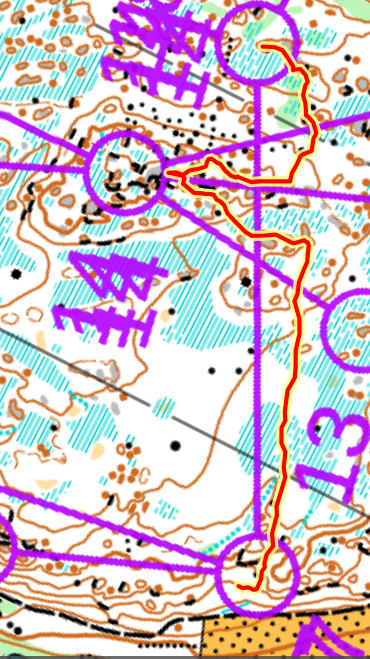

## Suunnistaa

- Osuus: 2
- 15 km (juoksin 17.7km, 210min, 1500/1600)
- Kauhava, Etelä-Pohjanmaa
- [Tulokset](https://online.jukola.com/tulokset/fi/j2024_ju/kilpailijat/1210/2/)
  [Livelox](https://www.livelox.com/Viewer/Lakia-Jukola-2024-Jukolan-Viesti/Jukolan-Viesti/2?classId=790631&relayLeg=2&tab=legView&leg=2)

## Kuvaus

Toinen osuus taas! Pitkä yö oli tosi pitkä tänä vuona. Viime vuona se oli vaan
13km, nyt 15km.

Se oli Vaasan aluella, Kauhava lentoasemalla. Maasto olisi matala ja nopea.

## Rastivälit

Numerot ovat rastiväli sijainti kautta juoksija. Eli joskus 1453/1552 ja joskus
460/523 kun haijointa.

- Vaihto-K: Pitkä! 1.6km tien ja pelon yli.
- K-1: Virhe tuli heti! Melkein juoksin kielettyyn alueen mutta en lähtenyt
  tieltä.
- 1-2: Hyvä tulos 0.83:
- 5-6: 0.973. En ymäärää. Ehkä kävelin koska se näytti niin vaikkea.
- 11-12: Toinen paras tulos 0.66. Aika kummalista koska pysähtyin väärällä
  kummarellä, mutta sain apua :)
- 13-14: 0.975 - aika kova ylämäki.
- 14-15: 0.69 - aika hyvä.
- 15-16: 0.984 (eli vaan 12 juoksija oli nopeampi). Okay tällä juoksin joku muu
  perässä mutta ne olivat jo otanut heidän rasti mikä oli haionassa. Siellä
  pelto/keiltainen oli myös talo, mikä ei ollut kartassa. En ollut varma että
  rasti oli siellä ylhällä mutta hyvä että se oli koska jos ei olisin niin
  eksinyt. Kyllä huomasin kun juoksin alaspäin että tä oli väärin mutta en
  uskonut itsensä.
- 17-18: 0.985 tämä oli vaan _vaikea_. En tiedä miksi, mutta käänsin vasemalle
  koska siellä ollut muut. En uskonut että olin linjalla. Ja en ollut muttä
  juoksin täysin liikaa vasemalle. Pysähtynyt kun näin yksi avokallio misä olin
  jo ollut..

[{:height=600}](images/f.2024.jukola.17-18.png)

- 21-22: Paras tulos! 0.63 (eli 282 juoksija oli hitaampi).

[{:height=600}](images/f.2024.jukola.21-22.png)

- 24-25: Juoksin vihreään ja se oli vaan liikaa vihreä ja otin vasemalle ja
  lähdin sieltä heti.
- 25-26: 0.79 luin kumpare kartassa ja näin ne maastossa. Tosi hauska
- 27-28: 0.90 polku, vihreän kautta, löysin ne kaksi kivejä ja sai hyvä suuntaa
  rastiin. Ihan suora.

## Lopussa

Sain paikka CSC:n joukuessa, niin kiitollinen.

Jalkat olivat niin väsyneitä, erityisesti polveet. Mutta päivän jälkeen kaikki
on ok, ilmeisesti ei mitän vaivoja tullut.

Ensi vuonna on Mikkeli, toivotavasti saan tulla mukaan myös sinne. Ehkä sen
jälkeen ei ole enää CSC tiima, eli pitäisi yrittää käyttää sunnistajanpankki.
Epäilen että saan paikka koska en ole nopea mutta ehkä on joku tiimi mikä kaikki
käy!
