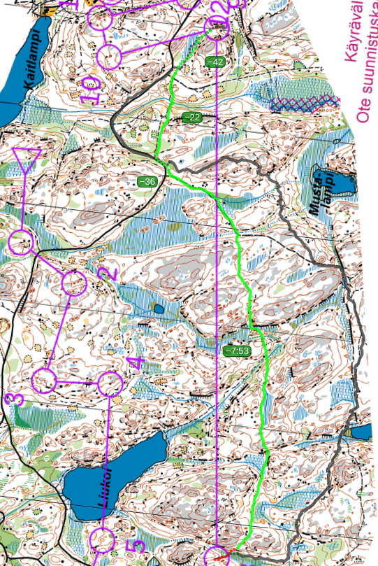

## Suunnistaa

- Lohko: c
- 4.92km (juoksin 6.69km, 71min, 62/82)
- Kattila, Espoo
- [Tulokset](https://navisport.com/events/cac8e105-e0ec-4967-aba5-a868927bbe7e/results/936f72a3-6cd9-46f6-879a-8d1ce40e0100)
  [Livelox](https://www.livelox.com/Viewer/Firmaliiga-Kattila/C?classId=827022&tab=player&selectedParticipantId=3058384)

## Kuvaus

Hauska suunnistus

## Rastivälit

- K-1: Kiva! Kuinka märkä on soita täällää? Yli vaaan!
- 1-3: Tällä aluella oli muutama selkeästi rajoitettu keltaisia alueita.
  Yritin noppa ne ja se toimii ihan hyvin.
- 3-4: Tiimikaveri otti minua kiini täällä. Sain vähän apua mutta seuravallle
  rastille hän oli nopeasti pois metsässä.
- 4-5: Ekä pitkä, järven yli. Myös hauskaa juosta ihan Liukoi vieressä :)
- 6-7: Menin soin yli, löysin rastin helposti; ja olin siellä ennen tiimikaverin!
  Suo oli aika märkkä eli 
- 7-8: Toinen suo yli vaan! Mutta suossa oli keltainen ja ei paljon vihreä - menin
  vaan yli. Käytin se keltainen suo kyn maamerkki kuinka vase pitäisin mennä mäessä.
- 8-9: Hirveä pitkä. Kesti noin 28 minuuttia. Oli montta vaihtoehtoa:
  - taksepäin ja isompi polun ympäri (lyhyin oli 2514m)
  - eteenpäin ja pienempi polut ympäri (lyhyin oli 2341m)
  - suora (lyin oli 1796m)
  Valitsin eteenpäin, mutta en totenut se hyvin. Juoksin 2889 metriä!

[{:height=800}](images/f.2024.kattila.8-9.png)

- 10-11: Ai just joo tällä oli melkein kilpailukeskustan kautta rasti :) Luulin että olin
  jo maalissa, ei vielä! Pitä ota mutama lisää, tarkaasti nyt.
- 12-13: Juoksin jonkin muu perässä ja käänsin liikaa oikealle. Saavuin jonkin toiseen
  luokan rastin. Huomasin :) Ehkä minuutin vai kahden bommi. Bommi kulji ylämäki, harmitti
  kun juoksin maaliin, olisi parempi jos minulla oli enemmän energia silloin.

## Lopussa

Sain uudelleen paikan CSC:n C-joukkueessa, olen tosi kiitollinen. Tänään oli
mukana vain kolme juoksijaa meiltä, ja he olivat minua parempia, mutta sain
silti monta pistettä tiimille :)

Lopputulos CSC C-joukkue oli tällä kaudella neljäs.
