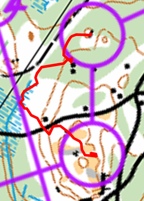

## Suunnistaa

- Lohko: Suunnistus 7km
- 7km (juoksin 9km, 1h28min, 71/83)
- Paloheinä, Helsinki
- [Tulokset](https://navisport.com/events/37f72d10-ac63-488d-b896-4f672ea73438/results/aacd8e83-59be-4925-9677-7e8335327ffa)
  [Livelox](https://www.livelox.com/Viewer/Iltarastit-Paloheina/7?classId=947834&tab=legView&leg=17)

## Kuvaus

Hyvä aika Paloheinässä!

Paljon juokssut metsässä ja ei niin kiertoreittijä polkulta. Silti +2km yhteensä :)

## Rastivälit

- 2-3: Oli hassu. En tarkistanut missä rasti oli. Vai mikä rasti oli. Juoksin liian syvää. Seurasin muut juoksijaa,
  jotkä menivät toiseen rastiin.
- 7-8: Enemmän kompassi. Outo S kurva. Silti hyvä tulos 57/83 tästä hieman pidempi osuus (431m)
- 8-9: Ei hyvin. +1.5minuuttia. Syy: epävarma rastinotto.
- 15-16: Hyvä tulos myös täällä. Lyhyt rasti. Luultavasti koska löysin hyvä, helpo ja turvallinen reitti alas mäeltä.
- 16-17: 1.5min bummi. 90 asetta väärä, en tarkistanut kartta hyvin

[{:height=400}](images/iltarastit20250505.16.17.png)

## Lopussa

Kiva! Juoksin aika nopeasti. 7km ja 90min eli noin 13min per km. Hieno että jalat pystyivät olla mukaan. Tuntui ihan
hyvä juostaa metsässä. Tarvitsen vaan uudet kengät. Pohja kohtaa lähte yhdestä kengästä :)
