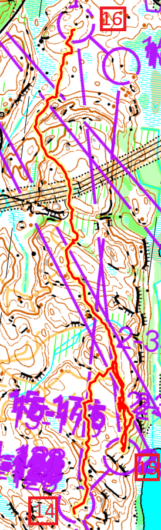
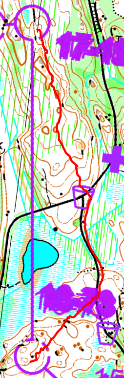

## Suunnistaa

- Osuus: 2
- 10 km (juoksin 13km, 210min, 1386/1615)
- Tikkala (Mikkeli), Etelä-Savo
- [Tulokset](https://results.jukola.com/tulokset-new/fi/j2025_ju/ju/kilpailijat/p2/?Popup=Competitor;1100;2)
  [Livelox](https://www.livelox.com/Viewer/Mikkeli-Jukola-2025-Jukolan-Viesti/Jukolan-Viesti/2?classId=988724&relayLeg=2)

## Kuvaus

Toinen osuus taas! Lyhempi kuin ennen, mutta paljon enemmän korkeuseroa.

Lännestä Mikkelistä. Paljon ylös ja alamäkeä.

Kun katsoin OC Puisto ne sanottii ehkä vaikein Jukola ikinä vai 50 vuotta.

## Rastivälit

Numerot ovat rastiväli sijainti kautta juoksija. Eli joskus 1453/1552 ja joskus
460/523 kun haijointa.

- Vaihto-K: Lyhyt
- K-1: Virhe tuli heti! En tarkistanut kompassi hyvin ja jostain syystä halusin
  kääntä vasemalle enemmän. Tehttin, paitsi olin yksin ja niin monta juoksi ohi
  oikealle suora tielle. Harmi. Mutta halusin tehtä ekä rasti tosi tarkaasti.
  Löysin se hieno valkoinen reitti mikä halusin lammeen. 345/402
- 1-2-3: 293/402 ja 347/402. Mutta, katsoin korkeuseroa ja seurasin niitä. En
  halunut jo heti alussa mennä alapain ja ylös pain turhaalla.
- 3-4: Pitkä. 1351/1602. Meni ihan ok. Olisi parempi jos menisin vähän enemmän
  s-kurvalle lopussa mutta löysin se aika helposti ilmeisesti.
- 4-5: Paras. 1118/1603. Seurata se vihreä alue toimi ihan hyvin.
- 6-7: Virhe tuli. Samustus-virhe. En tiennyt mikä mäki mä olin. Pitä juosta
  järveen ja sieltä löytä missä olin. Hm. Varmasti olisi parempi mennä vasemalle
  ja lammeen. 443/538 silti aika hyvä.
- 10-11: Pitkä väli. 1250/1603. Paras tunnelma juosta soita ja lammen vieressä.
  Tuoksi niin hyvin ja eikä ollut märkä soita! Näin melkein samalainen
  reitivalinta venlojen viestissä yle areenassa.
- 12-13: Tosi vaikea. Niin monta jyrkännettä siellä.
- 14-15: Ai mitäää. No näin yksi suunnistaja mikä hänellä oli ennen muutama sama
  rasteja kuin minä, ja vaan seurasin. Ihan väärään suuntaan (noh, noin 45
  astetta vääriin). Bah! 791/804
- 15-16: Pitkä. Mietin ekä ehkä oikealle olisi kiva ei niin korkeuseroa. Mutta
  se oli aika vihreä ja vaihtoin vasemalle/suorempi valinta. Kun katsoin
  liveloxilla oikealle olisi myös hjyvä valinta. Juoskin myös liikaa vasemalle
  mutta löysin se hyvin. Aina kiva kun osaan käyttä niitä korkeuseroa :) 694/804
- 16-17: Paras tunnelma. Suora ylöspäin. Monta juoksi oikealle tiellä. Ehkä ei
  samaan rastiin mutta silti monta tuli oikealta kun olin jo ylhällä. Eli
  vähemmän korkeuseroa minulle. 1315/1605.

[{:height=600}](images/f.2025.jukola.15-17.png)
[{:height=600}](images/f.2025.jukola.16-17.png)

## Lopussa

Siellä oli niin monta uria, ne kuljivät mäkeä ympäri.

Oli aika pölynen, siellä on ollut kuiva pitkän aikan.

Luultavasti viime vuonna CSC:n joukkue, mutta katsotaan. Jos ei ehkä
suunnistajanpankki ensi vuonna.

En ollut hyvää teltta-asentaja, mutta selvisin. Nyt olen jo parempi, laitoin se
yhteen viikon jälkeen ja se meni ihan hyvin :)

Ruokailuni meni ihan hyvin. Söin iltapala noin 21:30. Lepä, banaani ja yksi patuka.
Sitten vähän unta, sain noin puoli tuntti. Katsoin vähän ylessä. En katsonut startti,
oli liian pitkä matka sinne (> 2km). Kun kävelin sinne en tiennyt mikä tilanne oli, ja kävelin
tosi nopeasti. Se oli hyvä lämmittely. Odotin noin puoli tuntti vaihtopuomin vieressä
että ykkösosuus tuli vaihtoon. Tuntui aika kapea se puomi. Oli 4-5 henkilö riviä syvä jono.
Olin vaan juoksuvaateilla, oli lämmin yö.
Mutta katsoin ja tiesin mistä hän pitäisi tulla ja sitten se ilmestyi :)

Näin aurinkonousu. Juoksin hienoissa soitassa. Ja yksi niistä oli hieno lammen vieressä ja
se tuoksuu niin hyvä. Vaan syviä henkiä ja nautii ja sitten lisävoimalla eteenpäin!

Tämä ei ollut niin vaikea minulle. Vaikein itsellee oli ehkä Lahti Hollola kun oli melkein vaan
korkeuseroja kartassa. Vai muutama ehkä viime vuonna kun oli tosi tiheikkö / hiekka alue lopussa.

Täällä oli aika monta polkua/tietä, kuviaraja vai vihreä oli yleensä aika
selvä.

Otin mukaan liikaa juomavetta, oli niin monta juomapisteitä matkalla ja join vettä ehkä
hieman liikaa. Mutta se oli myös hyvä aika lukea kartaa ja sunnittella reitiä.

Sauna oli niin hyvä. Isompi ja vaan kolme saunaa.

Viikon ennen Jukola menin suunnistamaan Kasavuorella ja sain haava. Ehkä koska käytin
jalkapallosukat ja ei suunnistussukat. Laitoin blister laastari ja ei tuntennut mitään.
Käytin tämä kerttaa mun normi juoksi pohjalliset ja en tuntennut mittän myös polvelle, mitkä
olen tuntennut viime vuosia. Paras. Ei mikään jalkaongelmia tänä vuonna. Olin vaan hidas
ja seurasin muita liikaa :)
