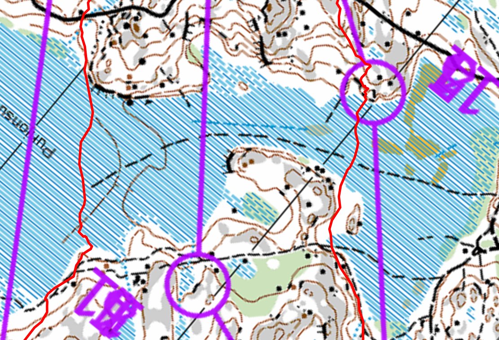

## Suunnistaa

[{:height=400}](images/huurt.25.soita.png)

- Lohko: Suunnistus 10km
- 10km (juoksin 12.22km, 2h11min, 75/114)
- Solvalla, Espoo
- [Tulokset](https://navisport.com/events/066e2a44-e6a2-409e-abc5-ba70d83dfe12/results/3757e146-be16-4597-80a5-74566f42549e)
  [Livelox](https://www.livelox.com/Viewer/Nuuksion-Huurteinen/10km?classId=1083198&live=false&tab=player&selectedParticipantId=4160816)

## Kuvaus

Märkät ja kylämt suot!

Toka kerttaa huurteisessa.

Hajonta oli käynnissä. Ja myös tämä kertta menin samaan rastiin muutama kertta.
Rasti 4/10 ja 6/12 oli sama, ja myös keirtorasti 7/14 just ennen maali oli myös
sama.

Tämä kertta rekisteröidin paljon aika ennen ja saapuin < 10min lähtöä eli
tarvitsin juostaa lähtöön :)

Sää oli mahtava. Aurinkoista. Kylmä oli. Joka kertta soita yli tulin oikeasti
kylmä, mutta muutama minuuttia jälkeen oli taas lämmin.

Hajonta oli. Lulltavasti 2 karttaa 10A 10B. Ja tuloksessä / split times /
väliaikat ne ovat sekaisin.

## Rastivälit

- K-1: Pitkä alus! Unohdin laitta gps/kello päällä mutta muistin ennen ykkönen.
  Juoksin suora. Soita yli. Kylmä oli! Ja heti tuli bummi, mutta ehkä isoin.
  Luulin että oli liian oikealli mutta olin liian vasemmalle.
- 1-2: Aika suora, vaan taas ylöspäin. Oli munta uria. Maasto oli valkoinen, ja
  missä muut oli juokssut oli vihreä.

- 2-3: Mahtava soita. Korkea polvet ja suora yli vaan. Aika kova meininki, mutta
  kun tuli joku hieno polku ja voi lähteä koko kroppa (ei vaan polvea :)
  eteenpäin oli hyvä fiilis.
- 3-4: Vaikea. 4 oli se yleisrasti. Sama joka kierros. Käytin soita ja mäkeä
  paljon. En voinut luota kiveä oli niin paljon.
- 4-5: Suo yli, mäkeä ympäri ja siellä se oli.
- 5-6: Löysin hyvä reitti suossa mikä ei ollut niin märkä. Jos menisin hiemän
  oikealle olisi ehkä muutama korkeuseroa vähemmän. Oli hieno suo myös
  keskimatkalla, jotka voisin vaan kierttaa. 6 rasti seisoin lähellä ja en
  nähnyt. Huonoin tulos. 107
- 6-7: Ei tarkka suunitelma, mutta löysin hyvä reitti kamppajyrkänne vierressä.

Toinen "kierros":

Maalilla, sain läpsy perheeltä missä oli siellä Solvassa pyörimässä. Heillä oli
kiva aika myös siellä metsässä :)

- 7-8: Otin sama kuin ehkä rastti ei tarvinnut miettiä liikaa vaan juostaa.
  Olipä märkkä täällä!
- 8-9: Pisin rastiväli. En tiedä vaan soitapäin, kierttä mäki ja sitten ylös.
  Olipa vaikkea. Kyllä oli pieniä polkkua mikä ei ole kartassa ja uria oli myös.
- 9-10: Tosi vaikea. Hidastanut ja lukenut kartta paljon.
- 10-11: Paras tulos jos uskon tulospalvelu :) Oliko tämä vai joku muu tosi
  hieno avokallio alaspäin ja missä aurinko lämmittely naamaan. Paras osa myös
  :)
- 11-12: En tarvinnut ota kierros oikealle siellä. Ehkä huonoin tulos. Mutta
  löysin se takaisin. Sain apua muita juoksijoita mihin ne menivät.
- 12-13: Helppo. Vaan sama kuin viime kierros. Näin ekä kertta että joku juoksut
  mäkeä ylös ja mietin miksi minä en mutta kun näin tämä karttassa aha oli se
  hajonta vai joku muu 15km etc.

## Lopussa

Olin väsynyt. En nukunut hyvin. Mutta tosi hyvin meni. Hauska että tuli just
sama sijainti lopussa kuin viime vuonna :)

Jos vertailen viime vuosia:

- juoksin vähemmän kilometriä
- olin nopeampi
- vähemmän korkeuseroa tämä kertta, mutta enemmän soita. Ihan paras vaihto :)
