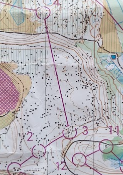

## Kivejä

Kiva kokeila erilainen maasto kuin yleensä PK seudulla. Paljon katuneitä puita, kivejä ja valkoista metsä.

Viime kertta olin Suunnistamassa Lahti lähellä oli varmasti Lahti-Hollola Jukola. Tuli mielen että haluasin käydä tähän
alueen enemmän.

- K-1: Helppo aloitus.
- 1-2: Heti vaikea. Vaan valkoinen metsä ja kivijä ja korkeuseroa. Ei mitään muuttaa yrittää saa se rasti kiini. Meni
  aika ok.
- 2-3: Laskin liikaa mutta löysin rastin helposti polun kautta.
- 3-4: Pitkä, mäki missä oli osi tasainen alue päällä ja paljon kivejä. Oli polku mäen päällä mutta se oli kivien
  välillä että en edes huomannut sita kartassa! No lähtin yritin mennä pohjoiseen suoraa. En mennyt. Tulin alas niin
  aikaisin ja oikealle ja vihreä alue ja oja..

[{:height=400}](images/nastola.3-4.png)

- 4-5: Alku osa menin keltainen alue yli, en ole varma olisi hyvä. Niin paljon vettä siellä ja syvä oli. Keski osa tien
  kautta. Loppu osa, tien kautta ja kompassi suunttaa.
- 5-6: Tosi kiva. Nousin heti, seurasin kuvioraja, menin enemmän oikealle että näin se avokallio mäki, ja näin sitä.
  Juoskin varmasti liikaa vasemmalle ja oikealle. Rastinotto näin myös noi valkoiset osat vaalea-vihreäaluella.
- 6-7: Juoksin liikaa oikealle, huomasin kun näin että oli tie eli otin liikaa korkeuseroa.
- 7-8: Tulin heti aika väsynyt 7 rastin jälkeen. En ollut varma mikä oli pohjoinen ja mihin olisin menossa. Koska kartta
  oli alas-ylöspäin (ja pitäisi olla, tämä jälkeen rata käänttä takaisin maaliin) ja luulin että 6 oli 9 ja :). No
  anyway kun tä hetki oli ohi löysin 8 rasti ihan mahtavaksi. Näin se kumpare ja jyrkänne .
- 8-9. Pisin väli. Paljon juoksu. Meni lammi/järvi vieressä. Olisi parempi jos laskin järven aste aikaisemmin, varmasti
  on polku siellä.
- 9-10: Iso pummi. Varmasti väsynyt 9 jälkeen. Yritin kompassillä mutta tulin liikaa oikealle, eli keskellä yksi tumma
  vireä mihin en halunut mennä. Päätin ota oikoreitti vihreä välillä. En pitänyt. En katsonut missä rasti pitäis olla,
  ja olin vihreä metsän ympärissä ennen että huomasin ai se on paljompi lähellä mäkeä ja olin tasaista aluella.
- 10-11: No mitäs mitäs, luulin että tämä tuli helppo. Mutta se oli piilotto tosi hyvin että en nähnyt sitä tiestä.
  Tulin varmasti just sopiva paikalla, mutta en uskonut. Juoskin sitten väärään suuntaan tiellä, kun huomasin että ei tä
  on väärä juoksin rastin ohi. Pysähdyn ja katsoin tarkemmin missä se pitäis olla.
- 11-12: Tosi kiva. Vaihtoehto oli mennä alas ja sitten ylös vai ympäri. Päätin vaan suora alas ja ylös.
- 12-13: Juoksin enemmän suora ylöspäin, mietin että ehkä parempi nyt kävellä ylöspäin ja sitten helpompi juostaa
  tasastia aluellä rastia kohti. Meni oki.

[Tulokset](https://www.nastolantera.fi/tulokset_130526) ja [Väliajat](https://www.nastolantera.fi/valiajat_130526)
